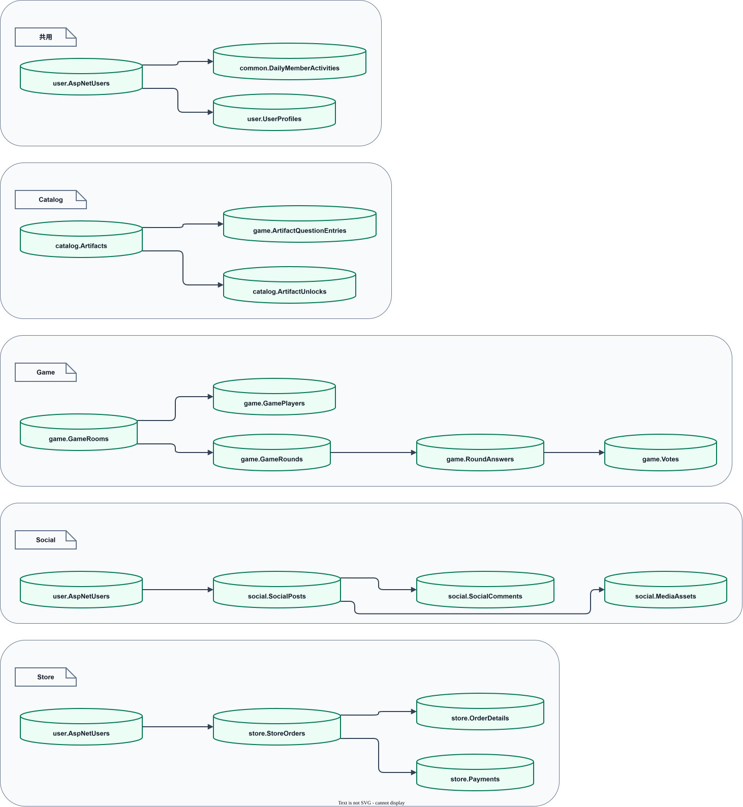

# 資料表參考

要查「資料存在哪張表」「兩張表如何連接」，先看本頁的表格用途與關聯。若問題是「前台會收到哪些欄位」，則查 API 契約：資料庫欄位不一定全部對外回傳。

本頁是 QMAH 資料表的文字字典，補充 [SSMS Diagram 建立參考](database-diagram.md) 不適合放進圖表的用途、主鍵、外鍵和開發注意事項。資料庫結構以 `QMAH/database/Schema.sql` 為準，Entity 與關聯映射以 `QMAH.Infrastructure/Data/QmahDbContext.cs` 為準；完整資料列則以 [QMAH-Database 的 Snapshot](https://github.com/MSIT173-03/QMAH-Database) 為準。

目前對照的共同資料版本是 `db-v0.8.0`。本頁不嵌入大型 `QMAH.sql`，也不把某一次程式提交當成資料庫版本。

## 資料查詢層次

`catalog.KeyTransactions.CreatedByAdminUserId` 是可空的管理員外鍵：人工異動保存管理員 ID，系統流程可留空。Schema 建表、Entity 與後續外鍵／索引使用相同欄位。更新結構檔不會自動修改既有資料庫；還原及升級方式見[資料工具](../reference/data-tools.md#選擇還原、升級或匯入)。

| 查詢問題 | 對應來源 | 這一層回答什麼 |
| --- | --- | --- |
| 表格、欄位、索引、CHECK 或外鍵是否存在 | `QMAH/database/Schema.sql` | SQL Server 實際結構契約 |
| LINQ 能否導覽、如何載入與儲存 | `QmahDbContext` 與 Entity | EF Core 的型別、Navigation、追蹤與關聯映射 |
| API 回傳哪些欄位 | [REST API 契約](../reference/rest-api.md) 與 DTO | 對外可見的資料形狀，不等於整張資料表 |
| 管理後台如何編輯 | [Area 責任與資料界線](area-boundaries.md) 與 ViewModel | 操作權限、輸入欄位、狀態與流程邊界 |
| 本機目前有多少資料 | [開發資料與本機展示](../getting-started/development-data.md) | `db-v0.8.0` Snapshot 的展示情境與資料量 |
| 如何重建或輸出共同資料 | [資料工具](../reference/data-tools.md) | 隔離資料庫、展示資料、Snapshot 與檔案交付 |

## Schema 分區

QMAH 目前在 `Schema.sql` 定義 7 個 Schema、54 張資料表。`Shared` 是文件上的跨系統入口，不是另一個 SQL Schema。

| Schema | 表格 | 主要責任 |
| --- | --- | --- |
| `user` | `Achievements`、`AspNetRoles`、`AspNetUsers`、`AspNetRoleClaims`、`AspNetUserClaims`、`AspNetUserLogins`、`AspNetUserRoles`、`AspNetUserTokens`、`UserAchievements`、`UserAddresses`、`UserProfiles`、`EquippedTitles` | Identity、會員資料、成就與稱號 |
| `catalog` | `ArtifactCategories`、`EraBuckets`、`Artifacts`、`ArtifactUnlocks`、`KeyDefinitions`、`KeyExchangeRules`、`KeyTransactions`、`UserKeyBalances`、`KeyProgressBalances`、`KeyProgressTransactions` | 文物、分類、年代、鑰匙與解鎖 |
| `game` | `ArtifactQuestionEntries`、`GameRooms`、`GamePlayers`、`GameRounds`、`RoundAnswers`、`Votes`、`GameRoomInvitations`、`GameEconomySettings`、`GameModeDefinitions`、`MiniGameAttempts` | 題庫、房間、回合、作答、投票與 Mini Game |
| `social` | `ContentReports`、`Events`、`OfficialAnnouncements`、`SocialPosts`、`MediaAssets`、`UserNotifications`、`EventRegistrations`、`SocialComments` | 內容、活動、檢舉、通知與社群媒體 |
| `store` | `CouponDefinitions`、`PointBalances`、`PointTransactions`、`Products`、`ProductReviews`、`UserCoupons`、`CartItems`、`StoreOrders`、`OrderDetails`、`Payments` | 商品、購物車、訂單、付款、優惠券與點數 |
| `admin` | `AuditLogs`、`EconomyAdjustmentBatches`、`CommunityRewardCampaigns` | 後台稽核與跨系統資產／活動規則 |
| `common` | `DailyMemberActivities` | 每日會員活動與登入歷史 |

## 主要關係

下列關係只列出跨功能最常用的導覽路徑；完整欄位、索引、刪除行為與 constraint 名稱仍以 `Schema.sql` 和 `QmahDbContext` 為準。

*圖 2：會員、文物、遊戲、社群、商城與營運資料最常用的跨系統導覽路徑；完整欄位仍以資料表字典與 Schema 為準。*

[圖表 IR 原始檔](../diagrams/data-relationships.json) · [draw.io 編輯檔（QMAH-Docs 專案）](https://github.com/MSIT173-03/QMAH-Docs/blob/main/diagrams/data-relationships.drawio)

`social.ContentReports.TargetType` 與 `TargetId` 是貼文／留言的多型目標欄位，不是 SQL 外鍵；查詢或處理檢舉時仍要依目標類型重新確認目標是否存在及目前狀態。會員、部分遊戲與社群欄位雖然有 `UserId`，仍以本頁列出的實際外鍵和程式流程判斷，不因欄位名稱相同而推定關聯。

## 逐表說明

### `common`

| 資料表 | 主鍵 | 主要外鍵 | 用途與開發注意 |
| --- | --- | --- | --- |
| `common.DailyMemberActivities` | `Id` | `UserId` → `user.AspNetUsers.Id` | 每日會員活動與登入歷史。每位會員每天最多一筆；登入天數、連續天數與登入率由歷史資料計算。 |

### `admin`

| 資料表 | 主鍵 | 主要外鍵 | 用途與開發注意 |
| --- | --- | --- | --- |
| `admin.AuditLogs` | `Id` | `ActorUserId` → `user.AspNetUsers.Id` | 管理操作的時間、操作者、目標與結果。不得保存密碼、Cookie、Token 或完整 request body。 |
| `admin.EconomyAdjustmentBatches` | `Id` | `CouponDefinitionId` → `store.CouponDefinitions.Id`；`CreatedByAdminUserId` → `user.AspNetUsers.Id` | 批次資產調整的條件、操作者與結果。會員優惠券會以 `GrantBatchId`／`RevokeBatchId` 回溯來源。 |
| `admin.CommunityRewardCampaigns` | `Id` | `EventId` → `social.Events.Id`；`GameRoomId` → `game.GameRooms.Id`；`OwnerUserId` → `user.AspNetUsers.Id`；`KeyDefinitionId` → `catalog.KeyDefinitions.Id` | 官方活動與私人房間的參與加碼規則。變更時要同時確認活動／房間範圍、鑰匙定義與發放流程。 |

### `catalog`

| 資料表 | 主鍵 | 主要外鍵 | 用途與開發注意 |
| --- | --- | --- | --- |
| `catalog.ArtifactCategories` | `Id` | — | 文物分類選項。`Code` 有唯一索引，新增或改名要同步篩選、匯入與展示資料。 |
| `catalog.EraBuckets` | `Id` | — | 文物篩選與出題使用的年代區間。區間邏輯需與匯入資料和前台篩選保持一致。 |
| `catalog.Artifacts` | `Id` | `CategoryId` → `ArtifactCategories.Id`；`EraBucketId` → `EraBuckets.Id` | 文物主資料、尺寸、來源、授權與邏輯媒體路徑。`ArtifactRef` 有唯一索引；關聯識別使用 `Id`，不以名稱、圖片檔名或顯示文字取代。 |
| `catalog.ArtifactUnlocks` | `Id` | `ArtifactId` → `Artifacts.Id`；`KeyTransactionId` → `KeyTransactions.Id`；`GameRoundId` → `game.GameRounds.Id`；`UserId` → `user.AspNetUsers.Id` | 會員解鎖文物的結果與來源。`UserId`／`ArtifactId` 有唯一限制；屬於歷史資料，不因文物下架而刪除。 |
| `catalog.KeyDefinitions` | `Id` | `CategoryId` → `ArtifactCategories.Id`；`EraBucketId` → `EraBuckets.Id` | 鑰匙類型、作用範圍與規則。`ScopeType` 受 CHECK constraint 限制，不能當成任意文字。 |
| `catalog.KeyExchangeRules` | `Id` | `SourceKeyDefinitionId`、`TargetKeyDefinitionId` → `KeyDefinitions.Id` | 鑰匙兌換規則。來源／目標組合有唯一索引，數量需符合正數限制。 |
| `catalog.KeyTransactions` | `Id` | `KeyDefinitionId` → `KeyDefinitions.Id`；`UserId` → `user.AspNetUsers.Id`；`CreatedByAdminUserId` → `user.AspNetUsers.Id` | 會員鑰匙異動流水。發放、消耗、兌換或回復都會留下原因；管理員人工調整保存操作管理員 ID，系統流程留空。 |
| `catalog.UserKeyBalances` | `UserId`、`KeyDefinitionId` | `UserId` → `user.AspNetUsers.Id`；`KeyDefinitionId` → `KeyDefinitions.Id` | 會員與鑰匙類型的餘額。複合主鍵識別一筆餘額；查帳時要和 `KeyTransactions` 一起核對。 |
| `catalog.KeyProgressBalances` | `UserId` | `UserId` → `user.AspNetUsers.Id` | Mini Game 鑰匙進度餘額。與一般鑰匙餘額分開保存，餘額不可為負。 |
| `catalog.KeyProgressTransactions` | `Id` | `UserId` → `user.AspNetUsers.Id` | Mini Game 進度與轉換一般鑰匙的流水。進度交易與一般鑰匙交易分開記錄。 |

### `game`

| 資料表 | 主鍵 | 主要外鍵 | 用途與開發注意 |
| --- | --- | --- | --- |
| `game.ArtifactQuestionEntries` | `Id` | `ArtifactId` → `catalog.Artifacts.Id` | 每件文物的題型、難度與可出題狀態。`ArtifactId` 有唯一索引，一件文物目前只有一筆題庫設定。 |
| `game.GameRooms` | `Id` | — | 遊戲房間設定、生命週期與時間。`WAITING`、`PLAYING`、`COMPLETED`、`CANCELLED` 是不同狀態，不能以刪除房間表示結束。 |
| `game.GamePlayers` | `Id` | `RoomId` → `GameRooms.Id`；`UserId` → `user.AspNetUsers.Id` | 房間與會員的參與關係。`ONLINE`、`OFFLINE`、`LEFT` 是連線／參與狀態，不等於帳號狀態。 |
| `game.GameRounds` | `Id` | `RoomId` → `GameRooms.Id`；`ArtifactId` → `catalog.Artifacts.Id` | 房間內的回合、選題與揭曉狀態。`ANSWERING`、`VOTING`、`REVEALED` 需和時間及作答規則一起驗證。 |
| `game.RoundAnswers` | `Id` | `GamePlayerId` → `GamePlayers.Id`；`RoundId` → `GameRounds.Id` | 玩家在回合中的作答結果。答案正確性、可否修改與結算由伺服器判定。 |
| `game.Votes` | `Id` | `VoterGamePlayerId` → `GamePlayers.Id`；`RoundId` → `GameRounds.Id`；`AnswerId` → `RoundAnswers.Id` | 玩家對答案的投票。需依資料庫唯一限制和流程檢查重複送出與並行更新。 |
| `game.GameRoomInvitations` | `Id` | `RoomId` → `GameRooms.Id`；`InviterUserId`、`InviteeUserId` → `user.AspNetUsers.Id`；`RewardCampaignId` → `admin.CommunityRewardCampaigns.Id`；`RewardKeyDefinitionId` → `catalog.KeyDefinitions.Id` | 私人房間邀請、接受／拒絕及可選獎勵。邀請狀態和房間狀態要分開處理。 |
| `game.GameEconomySettings` | `Id` | — | 多人主遊戲與 Mini Game 共用的經濟數值。數值有 CHECK constraint；調整時要確認既有結算結果不被回算改寫。 |
| `game.GameModeDefinitions` | `Id` | — | Mini Game 模式代碼、門檻、獎勵與設定。`Code` 有唯一索引，門檻順序與獎勵數值受 CHECK constraint 限制。 |
| `game.MiniGameAttempts` | `Id` | `GameModeDefinitionId` → `GameModeDefinitions.Id`；`ArtifactId` → `catalog.Artifacts.Id`；`UserId` → `user.AspNetUsers.Id` | Mini Game 開始、分數、等級、獎勵與結算。`STARTED`、`COMPLETED`、`EXPIRED` 是不同流程狀態。 |

### `social`

| 資料表 | 主鍵 | 主要外鍵 | 用途與開發注意 |
| --- | --- | --- | --- |
| `social.SocialPosts` | `Id` | `EventId` → `Events.Id`；`ArtifactId` → `catalog.Artifacts.Id`；`UserId` → `user.AspNetUsers.Id` | 一般貼文與公告貼文。`PUBLISHED`、`HIDDEN`、`DELETED` 分開保存；作者、文物與活動是明確關聯。 |
| `social.SocialComments` | `Id` | `ParentCommentId` → `SocialComments.Id`；`PostId` → `SocialPosts.Id`；`UserId` → `user.AspNetUsers.Id` | 留言與回覆。父子樹、貼文、作者與狀態需一起驗證。 |
| `social.ContentReports` | `Id` | `ReporterUserId`、`ReviewedByUserId` → `user.AspNetUsers.Id`；目標由 `TargetType`／`TargetId` 表示 | 貼文或留言檢舉。目標欄位不是 SQL 外鍵，處理前要重新查目標和目前可見狀態。 |
| `social.Events` | `Id` | `OrganizerUserId`、`ReviewedByUserId` → `user.AspNetUsers.Id` | 活動審核、發布、開始結束、截止日與容量。審核狀態和發布狀態是兩組不同欄位。 |
| `social.EventRegistrations` | `Id` | `EventId` → `Events.Id`；`UserId` → `user.AspNetUsers.Id`；`RewardCampaignId` → `admin.CommunityRewardCampaigns.Id`；`RewardKeyDefinitionId` → `catalog.KeyDefinitions.Id` | 活動報名與出席。重複報名、取消、出席與獎勵要分開處理。 |
| `social.OfficialAnnouncements` | `Id` | `CreatedByUserId` → `user.AspNetUsers.Id` | 舊公告模型的結構相容表。新公告使用 `SocialPosts` 的公告貼文類型，兩種模型不重複寫入同一份內容。 |
| `social.UserNotifications` | `Id` | `UserId` → `user.AspNetUsers.Id` | 會員通知與已讀狀態。通知由事件流程產生；更新範圍限於目前會員。 |
| `social.MediaAssets` | `Id` | `OwnerUserId` → `user.AspNetUsers.Id`；`PostId` → `SocialPosts.Id` | 社群媒體檔案的中繼資料、替代文字與貼文關聯。實際網址交給媒體 Resolver，不把環境網址寫死在資料列。 |

### `store`

| 資料表 | 主鍵 | 主要外鍵 | 用途與開發注意 |
| --- | --- | --- | --- |
| `store.Products` | `Id` | `ArtifactId` → `catalog.Artifacts.Id` | 商品內容、價格、庫存與上下架狀態。文物對應可為空但有唯一限制；商品欄位獨立保存。 |
| `store.CartItems` | `Id` | `ProductId` → `Products.Id`；`UserId` → `user.AspNetUsers.Id` | 會員購物車項目。同一會員與商品不可重複建列，結帳時要重新確認商品現況。 |
| `store.StoreOrders` | `Id` | `UserCouponId` → `UserCoupons.Id`；`UserId` → `user.AspNetUsers.Id` | 訂單主檔與流程狀態。訂單狀態、付款狀態、商品上下架狀態分開保存。 |
| `store.OrderDetails` | `Id` | `OrderId` → `StoreOrders.Id`；`ProductId` → `Products.Id` | 成交明細。品名、單價、數量與金額是成交快照，不跟隨商品現值改寫。 |
| `store.Payments` | `Id` | `OrderId` → `StoreOrders.Id` | 付款處理結果與交易資訊。`OrderId` 有唯一限制，目前一張訂單對應一筆付款紀錄。 |
| `store.CouponDefinitions` | `Id` | — | 折價券定義、折扣方式、取得方式與有效期間。`PERCENT`／`FIXED` 等代碼受資料庫與流程規則限制。 |
| `store.UserCoupons` | `Id` | `CouponDefinitionId` → `CouponDefinitions.Id`；`UserId` → `user.AspNetUsers.Id`；管理員與發放／撤銷批次欄位連到 `user.AspNetUsers`、`admin.EconomyAdjustmentBatches` | 會員持券、使用、過期與撤銷狀態。券的定義與某會員手上的券不是同一層資料。 |
| `store.PointBalances` | `UserId` | `UserId` → `user.AspNetUsers.Id` | 會員點數餘額。一位會員一筆餘額；異動原因要寫入 `PointTransactions`。 |
| `store.PointTransactions` | `Id` | `UserId` → `user.AspNetUsers.Id`；`CreatedByAdminUserId` → `user.AspNetUsers.Id` | 點數異動流水。管理員人工調整保存操作管理員 ID，系統獎勵或消耗流程留空；查帳、回溯與重複請求判斷以流水為主。 |
| `store.ProductReviews` | `Id` | `ProductId` → `Products.Id`；`UserId` → `user.AspNetUsers.Id` | 商品評價與公開狀態。摘要只計入已發布評價，隱藏與刪除紀錄仍保留。 |

### `user`

| 資料表 | 主鍵 | 主要外鍵 | 用途與開發注意 |
| --- | --- | --- | --- |
| `user.AspNetUsers` | `Id` | — | ASP.NET Core Identity 帳號主表。密碼、鎖定、登入與角色操作交給 Identity API，不直接 CRUD。 |
| `user.AspNetRoles` | `Id` | — | Identity 角色定義。角色名稱與 Claim 關聯由 Identity 管理。 |
| `user.AspNetUserRoles` | `UserId`、`RoleId` | `UserId` → `AspNetUsers.Id`；`RoleId` → `AspNetRoles.Id` | 帳號與角色對應。授權判斷以 Identity 與伺服器端 Policy 為準，不以前台按鈕顯示狀態取代。 |
| `user.AspNetRoleClaims` | `Id` | `RoleId` → `AspNetRoles.Id` | 角色 Claim。由 Identity 流程使用；目前共同 Snapshot 可維持空白。 |
| `user.AspNetUserClaims` | `Id` | `UserId` → `AspNetUsers.Id` | 會員 Claim。由 Identity 流程管理，不交給一般會員表單模型直接寫入。 |
| `user.AspNetUserLogins` | `LoginProvider`、`ProviderKey` | `UserId` → `AspNetUsers.Id` | 外部登入連結。功能未啟用時可為空，由 Identity provider 流程建立。 |
| `user.AspNetUserTokens` | `UserId`、`LoginProvider`、`Name` | `UserId` → `AspNetUsers.Id` | Identity 持久 Token。不得把 Token 寫入文件、展示資料或一般 log。 |
| `user.UserProfiles` | `UserId` | `UserId` → `AspNetUsers.Id` | QMAH 會員暱稱、簡介與公開資料。一位會員一份 Profile；修改使用專用 ViewModel 與並行控制。 |
| `user.UserAddresses` | `Id` | `UserId` → `AspNetUsers.Id` | 會員收件地址與預設地址。展示資料不放入真實個資；預設地址規則和並行修改依 Schema 驗證。 |
| `user.Achievements` | `Id` | — | 成就定義、條件、門檻與啟用狀態。停用定義不等於刪除會員已取得的紀錄。 |
| `user.UserAchievements` | `Id` | `AchievementId` → `Achievements.Id`；`UserId` → `AspNetUsers.Id` | 會員取得成就的歷史紀錄。稱號和進程查詢以這層取得結果為依據。 |
| `user.EquippedTitles` | `UserId` | `UserId` → `AspNetUsers.Id`；`UserAchievementId` → `UserAchievements.Id` | 會員目前裝備的稱號，一位會員最多一筆。外鍵保證取得紀錄存在；同會員歸屬由 `EconomyService.SetEquippedTitleAsync` 檢查，不能把它當成已由複合外鍵保證。 |

## 開發須知

### 1. 修改資料表時的順序

1. 在 SQL Server 設計中確認欄位、NULL、預設值、索引、外鍵、CHECK、唯一限制與歷史資料策略。
2. 將同一個結構變更寫入 `QMAH/database/Schema.sql`，確認乾淨資料庫可以重建。
3. 更新 Scaffold 產生或維護的 Entity、`QmahDbContext` 與 Navigation；DB-first 契約不以 EF Migration 取代。
4. 核對 API DTO、管理後台 ViewModel、Angular 畫面、資料工具與文件；跨 Repository 的變更要在同一項交付中說明版本基準。
5. 在隔離資料庫驗證展示資料和既有資料，再由 Snapshot pipeline 輸出新的 QMAH-Database 檔案與 manifest。

### 2. 讀寫與歷史資料

- 單表讀寫可由 Controller 使用注入的 `QmahDbContext`；跨表、長流程、外部服務、重複請求或資產結算使用明確 Service。
- 查詢優先使用投影與必要的 `AsNoTracking()`；需要更新的 Entity 才交給追蹤流程，並依 `RowVersion` 處理並行修改。
- 跨表寫入要說明交易範圍、冪等鍵、失敗回復與重試行為。已成立的訂單、付款、點數、回合、投票、解鎖與內容紀錄不以實體刪除取代狀態。
- Angular 只讀取 API DTO；Razor 後台依 Area、Controller、ViewModel 與實際授權操作，不讓畫面直接決定資料權限。

### 3. 共同 Snapshot 與本機資料

- 網站啟動不建立 Schema、不執行 Migration、不自動補跑 Patch 或 Seed，也不覆寫本機資料庫。
- 本機需要共同資料時，依 [開發資料與本機展示](../getting-started/development-data.md) 還原 `QMAH-Database` 的已驗證 Snapshot；資料量與狀態以該 tag 的 manifest 為準。
- `seed-showcase-users` 與 `generate-showcase-data` 只在隔離資料庫使用。密碼檔、log、備份檔與工具輸出不提交到 Repository。

### 4. 變更前最小檢查

- 是否能指出主責 Schema、主鍵、外鍵、唯一限制與狀態 constraint。
- 是否知道這個欄位是 API DTO、ViewModel、Entity 或資料表欄位，沒有把其中一層當成另一層。
- 是否檢查空資料、查無資料、重複請求、並行修改、停用／刪除、權限不足與跨系統失敗路徑。
- 是否同步 `Schema.sql`、Entity、`QmahDbContext`、API、前台、後台、資料工具、文件與必要的 Snapshot 版本。

## 相關文件

- [API 經濟與進程操作](../reference/rest-api.md#經濟、進程與社群加碼)：核對 API 使用的是定義 ID、會員取得紀錄 ID 或批次 ID。
- [管理員補發鑰匙的實際呼叫](runtime-and-shared-services.md#管理員增加三把鑰匙的實際呼叫)：從操作入口追到餘額、流水及管理員欄位。

- [SSMS Diagram 建立參考](database-diagram.md)：建立與閱讀關聯圖，不重複承擔逐表文字說明。
- [資料存取與 DB-first](data-access.md)：EF Core、投影、追蹤、交易、並行與刪除邊界。
- [Area 責任與資料界線](area-boundaries.md)：五個功能系統的主責資料與跨系統引用。
- [開發資料與本機展示](../getting-started/development-data.md)：共同 Snapshot 的資料量、狀態與還原方式。
- [資料工具](../reference/data-tools.md)：展示資料、Seed、匯出與 Snapshot pipeline。
