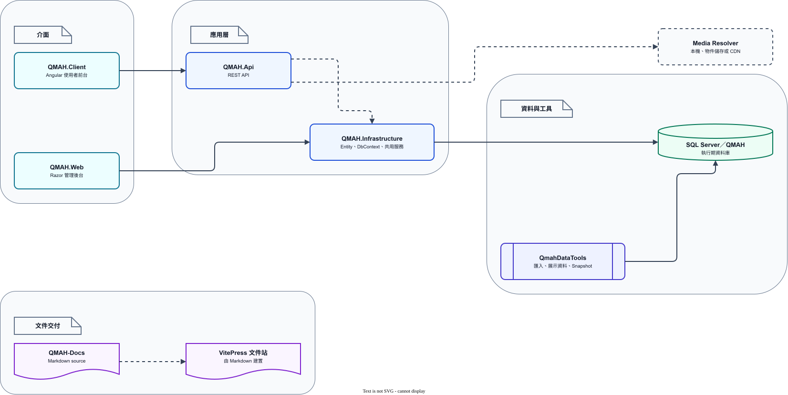

# 系統架構總覽

`QMAH` 保存 `QMAH.Api`、`QMAH.Web`、`QMAH.Client`、`QMAH.Infrastructure` 與 `Schema.sql`；`QMAH-Database` 保存 `db-v0.8.0` 完整 Snapshot；`QMAH-Docs` 保存這些元件的操作、契約、架構與查閱路線。

本頁說明 QMAH 的執行面，以及資料庫、文件和資料工具的責任關係。五個功能系統與營運中心可以平行開發；開始單一工作前，依需求閱讀 [Area 責任與資料界線](area-boundaries.md)、[資料表參考](database-reference.md)、[資料存取與 DB-first](data-access.md) 或 [Angular 使用者前台開發](../frontend/angular-development.md)。跨文件的名詞定義見[文件閱讀與名詞基準](../reference/terminology.md)。

## 系統如何運作

*圖 1：QMAH 前台、API、管理後台、共用基礎、資料工具、資料庫與媒體交付的責任關係。*

[圖表 IR 原始檔](../diagrams/system-architecture.json) · [draw.io 編輯檔（QMAH-Docs 專案）](https://github.com/MSIT173-03/QMAH-Docs/blob/main/diagrams/system-architecture.drawio)

前台只讀取 API 的 DTO 與狀態。管理後台在 `QMAH.Web` 以 Area、Controller、ViewModel 與 Razor View 組成；共用資料存取與 Identity 規則位於 `QMAH.Infrastructure`。

資料工具屬於 Snapshot 產製流程，不會由網站啟動流程建立結構或寫入展示資料。

## Repository 與專案責任

| 位置 | 主要責任 | 不應承擔的責任 |
| --- | --- | --- |
| `QMAH.Api` | REST API、DTO、OpenAPI、前台需要的驗證與功能操作 | 直接暴露 Entity 或管理後台 ViewModel |
| `QMAH.Web` | Razor 管理後台、Area、Tabler Layout、表單驗證 | 讓前台繞過 API 讀取管理資料 |
| `QMAH.Infrastructure` | Entity、`QmahDbContext`、Identity、共用服務與資料存取 | 以 EF Migration 取代 DB-first Schema |
| `QMAH.Client` | Angular standalone 元件、Router、HttpClient 與使用者體驗 | 拼接圖片路徑或猜測資料表欄位 |
| `tools/QmahDataTools` | 匯入、展示資料、Snapshot 匯出與驗證 | 讓一般網站啟動自動執行資料批次 |
| `QMAH/database/Schema.sql` | QMAH 主 Repository 的結構契約 | 存放完整資料與大型可還原 Snapshot |
| `QMAH-Database` | 完整 `QMAH.sql`、manifest 與版本歷史 | 取代產品程式或 API 文件 |

## DB-first 邊界

SQL Server Schema 是共同契約。新增或修改資料表、欄位、索引、外鍵、約束或 `rowversion` 時，先在資料庫與 `Schema.sql` 確認設計。

接著核對 Scaffold 產生的 Entity、`QmahDbContext`、API DTO、管理後台 ViewModel 與文件。完整 Snapshot 要由同一次驗證流程輸出到 [QMAH-Database](https://github.com/MSIT173-03/QMAH-Database)，不把資料庫增量腳本當成網站啟動步驟。

## 依責任查閱文件

- Area 內的資料表、狀態與跨區域規則： [Area 責任與資料界線](area-boundaries.md)
- 從啟動、Controller 到共用 Service 與流水的流程： [應用程式啟動與共用服務](runtime-and-shared-services.md)
- 逐表用途、主鍵、外鍵與 Schema 分區： [資料表參考](database-reference.md)
- 查詢、交易、`RowVersion` 與服務判斷： [資料存取與 DB-first](data-access.md)
- API 與前台欄位： [REST API 契約](../reference/rest-api.md)
- Snapshot、展示資料與匯出檢查： [資料工具參考](../reference/data-tools.md)
