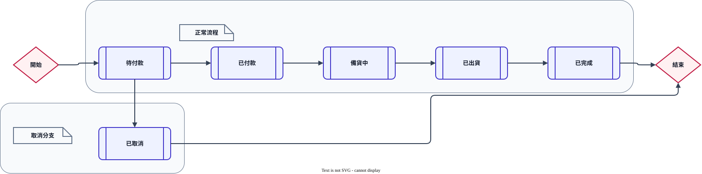

# 開發資料與本機展示

QMAH 使用一套共同資料庫設計。每個本機環境還原一份 `QMAH` 資料庫副本，使用相同 Schema 與共同基準資料；本機新增、修改或刪除的測試資料不會影響其他副本。

## 1. 取得共同資料

目前相容的完整 Snapshot 是 QMAH-Database tag `db-v0.7.0` 的 [`QMAH.sql`](https://github.com/MSIT173-03/QMAH-Database/blob/db-v0.7.0/QMAH.sql)，可直接在 SSMS 執行。

若另有同一版本且已驗證的 `.bak`，也可以用 SSMS 還原。QMAH 主 Repository 的 Release 目前只保留版本導覽，不再提供 SQL／BAK 資產。

兩種還原方式擇一即可。資料庫還原步驟詳見[資料工具參考](../reference/data-tools.md)。

完成其中一種方式後即可直接用 Visual Studio 啟動網站。網站啟動時不會建表、重設資料、執行 Seed 或覆寫本機資料。

共同 Snapshot 包含：

- SQL Server Schema、索引、外鍵與 CHECK constraint
- 256 件文物、256 筆題庫設定與 256 件對應商城商品
- 各 Area 用於清單、詳情、關聯與狀態畫面的代表性測試資料
- Identity 帳號、角色與會員資料；後台稽核與社群媒體資料表結構

## 2. Snapshot 內容

下表數量以 QMAH-Database `db-v0.7.0` 的完整資料庫 Snapshot 為準。

逐表確認用途、主鍵或外鍵時，詳見[資料表參考](../architecture/database-reference.md)。本節保留 Snapshot 的資料量、狀態與展示情境；不在這裡重複維護完整資料字典。

還原後已包含社群、商城、遊戲與營運頁面需要的展示情境，不需要再執行增量資料工具。`generate-showcase-data` 只用於隔離資料庫重建資料，或在產生下一份 Snapshot 前準備資料。

批次參數不代表另一個 Release，也不是還原後的必要步驟。`dbo.sysdiagrams` 是 SSMS 使用的系統表，不列入 QMAH 業務資料表數量。

### 2.1 共用 Schema

| Schema | 主要內容 | 目前資料概況 |
| --- | --- | --- |
| `common` | 每日會員活動與登入歷史 | 依展示會員的每日登入／簽到資料累積；每位會員每天每種活動類型最多一列 |
| `admin` | 後台稽核操作與批次資產活動 | 1 筆稽核紀錄、2 筆官方／會員加碼規則；批次資產活動目前尚未執行 |
| `catalog` | 文物、分類、年代、鑰匙、解鎖 | 8 類、12 個年代桶、256 件文物、20 筆鑰匙兌換規則與相關流水 |
| `game` | 題庫設定、房間、玩家、回合、作答、投票與 Mini Game 契約 | 256 筆題庫設定、9 個房間、19 筆玩家紀錄、20 個回合與 4 個 Mini Game 模式 |
| `social` | 貼文（含官方公告類型）、留言、檢舉、活動、報名、通知、社群媒體 | 336 篇貼文、768 篇留言、3 筆檢舉、7 個活動與 7 筆報名；圖片依實際上傳累積 |
| `store` | 商品、購物車、優惠券、訂單、付款、點數 | 256 件商品、208 組訂單／付款紀錄、17 張優惠券定義與 96 筆商品評價 |
| `user` | Identity、Profile、地址、成就 | 24 個帳號、2 個角色、24 筆 Profile 與會員情境 |

### 2.2 Catalog

| 資料表 | 筆數 | 用途 |
| --- | ---: | --- |
| `ArtifactCategories` | 8 | 正式文物分類 |
| `EraBuckets` | 12 | 篩選與出題使用的年代區間 |
| `Artifacts` | 256 | 文物主資料、尺寸、圖片、來源與授權 |
| `KeyDefinitions` | 23 | 鑰匙規則與作用範圍 |
| `UserKeyBalances` | 49 | 會員鑰匙餘額情境 |
| `KeyTransactions` | 51 | 鑰匙異動流水情境 |
| `KeyProgressBalances` | 0 | Mini Game 累積鑰匙進度餘額；首次產生進度時建立 |
| `KeyProgressTransactions` | 0 | Mini Game 鑰匙進度與轉換一般鑰匙的流水 |
| `KeyExchangeRules` | 20 | 後台可調整的來源／目標鑰匙兌換規則 |
| `ArtifactUnlocks` | 0 | 尚未建立解鎖紀錄；功能啟用後由實際行為產生 |

### 2.3 Game

| 資料表 | 筆數 | 用途 |
| --- | ---: | --- |
| `ArtifactQuestionEntries` | 256 | 每件文物的題型、難度與啟用設定 |
| `GameRooms` | 9 | 3 筆 `WAITING`、2 筆 `PLAYING`、2 筆 `COMPLETED`、2 筆 `CANCELLED` |
| `GamePlayers` | 19 | 10 位 `ONLINE`、1 位 `OFFLINE`、8 位 `LEFT`，可測試玩家與連線狀態清單 |
| `GameRounds` | 20 | 1 個 `ANSWERING`、1 個 `VOTING`、18 個 `REVEALED` 回合 |
| `RoundAnswers` | 36 | 不同回合與玩家的作答內容 |
| `Votes` | 36 | 玩家對作答的投票紀錄 |
| `GameRoomInvitations` | 3 | 私人房間邀請與接受、拒絕情境 |
| `GameEconomySettings` | 1 | 多人主遊戲與 Mini Game 共用的經濟設定 |
| `GameModeDefinitions` | 4 | `DETAIL_LOCATOR`、`ARTIFACT_PUZZLE`、`MEMORY_MATCH`、`STRIP_RESTORE` |
| `MiniGameAttempts` | 0 | Mini Game 開始與結算後由實際操作產生 |

### 2.4 Social

| 資料表 | 筆數 | 用途 |
| --- | ---: | --- |
| `SocialPosts` | 336 | 320 筆 `PUBLISHED`、10 筆 `HIDDEN`、6 筆 `DELETED` |
| `SocialComments` | 768 | 不同貼文的主留言與回覆，保留父子討論脈絡 |
| `ContentReports` | 3 | 2 筆 `PENDING` 與 1 筆 `RESOLVED` 檢舉 |
| `OfficialAnnouncements` | 0 | 新公告使用 `SocialPosts` 的公告貼文類型；舊表僅保留結構相容性 |
| `Events` | 7 | 涵蓋待審核、已通過、未通過、草稿、已發布與已取消情境 |
| `EventRegistrations` | 7 | 4 筆 `REGISTERED`、3 筆 `ATTENDED` 報名與出席情境 |
| `UserNotifications` | 0 | 尚未建立通知；功能啟用後由實際事件產生 |
| `MediaAssets` | 0 起 | 社群上傳圖片的中繼資料；官方文物圖鑑圖片不列入此表 |

### 2.5 Admin

| 資料表 | 筆數 | 用途 |
| --- | ---: | --- |
| `AuditLogs` | 1 筆起，由後台操作累積 | 管理操作的時間、操作者、目標與結果；不保存密碼、Cookie、Token 或 request body |
| `EconomyAdjustmentBatches` | 0 | 批次點數／優惠券活動；執行批次後保存篩選條件與結果 |
| `CommunityRewardCampaigns` | 2 | 官方活動與會員私人房間的參與加碼規則 |

### 2.6 Store

| 資料表 | 筆數 | 用途 |
| --- | ---: | --- |
| `Products` | 256 | 與文物一對一的縮小複製品商品 |
| `ProductReviews` | 96 | 88 筆 `PUBLISHED`、5 筆 `HIDDEN`、3 筆 `DELETED`；公開摘要只計入已發布評價 |
| `CartItems` | 0 | 尚未建立購物車內容；功能啟用後由會員操作產生 |
| `CouponDefinitions` | 17 | 5 張常駐點數兌換券，以及 12 張管理員發放展示券 |
| `UserCoupons` | 15 | 7 張可用、5 張已使用與 3 張已過期優惠券情境 |
| `StoreOrders` | 208 | 涵蓋六種訂單狀態：30 筆取消、38 筆完成、35 筆備貨、39 筆已付款、31 筆待付款、35 筆已出貨 |
| `OrderDetails` | 298 | 多商品訂單的成交品名、單價與數量快照 |
| `Payments` | 208 | 31 筆 `PENDING`、147 筆 `PAID`、30 筆 `FAILED` |
| `PointBalances` | 5 | 會員點數餘額 |
| `PointTransactions` | 20 | 點數異動流水 |

### 2.7 User 與 Identity

| 資料表 | 筆數 | 用途 |
| --- | ---: | --- |
| `AspNetUsers` | 24 | 8 個主要情境帳號與 16 個展示會員 |
| `AspNetRoles` | 2 | `Admin`、`User` |
| `AspNetUserRoles` | 24 | 帳號與角色對應 |
| `UserProfiles` | 24 | 每個展示帳號都有自然的暱稱、簡介與公開範圍 |
| `UserAddresses` | 27 | 不同收件用途的地址情境；不使用真實個資 |
| `Achievements` | 20 個啟用中、7 個停用 | 圖鑑、多人遊戲、Mini Game、社群與活動成就 |
| `UserAchievements` | 68 | 會員取得成就情境 |
| `DailyMemberActivities` | 目前展示會員的每日登入／簽到歷史 | 每位會員每天每種活動類型最多一列；登入天數、連續天數與登入率由登入歷史即時計算 |
| `AspNetRoleClaims` | 0 | 尚未建立角色 Claim |
| `AspNetUserClaims` | 0 | 尚未建立會員 Claim |
| `AspNetUserLogins` | 0 | 第三方登入尚未啟用 |
| `AspNetUserTokens` | 0 | 尚未產生持久 Token |

Claim、外部登入與 Token 維持空白是刻意的。這三張表由 Identity 在功能真正啟用時寫入，不需要為了讓每張表都有資料而建立假資料。

## 3. 文物、題庫與商城商品的關係

`catalog.Artifacts` 是文物主資料。題庫與商城都以外鍵 `ArtifactId` 對應同一件文物：

```text
catalog.Artifacts.Id
  ├─ game.ArtifactQuestionEntries.ArtifactId
  └─ store.Products.ArtifactId
```

三邊共用同一張 Open Data 文物圖片，不重複保存圖片檔。

- 題庫另外保存題型、難度與是否可出題
- 商品另外保存名稱、文案、換算尺寸、售價、庫存與上架狀態
- 商品或題庫可以獨立停用
- 已成立的訂單、回合、作答與投票屬於歷史資料，不因文物或商品下架而刪除

## 4. 狀態與類型代碼

下列值由 SQL Server CHECK constraint 限制，不是自由輸入文字。Controller、ViewModel 與下拉選單使用相同代碼，中文只用於畫面顯示。

| 範圍 | 欄位 | 合法值 |
| --- | --- | --- |
| Catalog | `KeyDefinitions.ScopeType` | `NORMAL`（一般）、`CATEGORY`（分類）、`ERA`（年代）、`UNIVERSAL`（通用） |
| Game | `GamePlayers.ConnectionStatus` | `ONLINE`（在線）、`OFFLINE`（暫時離線）、`LEFT`（已離開） |
| Game | `GameRooms.Status` | `WAITING`（等待中）、`PLAYING`（進行中）、`COMPLETED`（已完成）、`CANCELLED`（已取消） |
| Game | `GameRounds.Status` | `ANSWERING`（作答中）、`VOTING`（投票中）、`REVEALED`（已揭曉） |
| Game | `RoundAnswers.AnswerType` | `FACTUAL_REASONING`（事實推理）、`PLAUSIBLE_FICTION`（合理虛構）、`CREATIVE_TALE`（創意故事） |
| Social | `SocialPosts.Status`、`SocialComments.Status` | `PUBLISHED`（已發布）、`HIDDEN`（已隱藏）、`DELETED`（已刪除） |
| Social | `ContentReports.Status` | `PENDING`（待處理）、`RESOLVED`（已處理）、`REJECTED`（不成立） |
| Social | `ContentReports.TargetType` | `POST`（貼文）、`COMMENT`（留言） |
| Social | `Events.EventType` | `OFFICIAL`（官方活動）、`PLAYER`（玩家活動） |
| Social | `Events.ReviewStatus` | `PENDING`（待審核）、`APPROVED`（已通過）、`REJECTED`（未通過） |
| Social | `Events.PublishStatus` | `DRAFT`（草稿）、`PUBLISHED`（已發布）、`CANCELLED`（已取消） |
| Social | `EventRegistrations.Status` | `REGISTERED`（已報名）、`ATTENDED`（已出席）、`CANCELLED`（已取消） |
| Social | `OfficialAnnouncements.Status` | `DRAFT`（草稿）、`PUBLISHED`（已發布）、`ARCHIVED`（已封存；僅相容舊資料） |
| Store | `StoreOrders.Status` | `PENDING_PAYMENT`（待付款）、`PAID`（已付款）、`FULFILLING`（備貨中）、`SHIPPED`（已出貨）、`COMPLETED`（已完成）、`CANCELLED`（已取消） |
| Store | `Payments.Status` | `PENDING`（處理中）、`PAID`（付款成功）、`FAILED`（付款失敗）、`CANCELLED`（已取消） |
| Store | `CouponDefinitions.DiscountType` | `PERCENT`（百分比折扣）、`FIXED`（固定金額折抵） |
| Store | `CouponDefinitions.AcquisitionType` | `POINT_EXCHANGE`（鑑定點數兌換）、`ADMIN_GRANT`（管理員發放） |
| Store | `UserCoupons.Status` | `AVAILABLE`（可使用）、`USED`（已使用）、`EXPIRED`（已過期）、`REVOKED`（已撤銷） |
| User | `AspNetUsers.Status` | `ACTIVE`（正常）、`DISABLED`（停用）、`BANNED`（停權） |
| User | `Achievements.Status` | `ACTIVE`（啟用）、`INACTIVE`（停用） |

訂單使用 `PENDING_PAYMENT`，因為訂單後續還會進入備貨、出貨等階段；付款紀錄位於 `Payments`，`PENDING` 已能表示該筆交易尚未取得結果。

成就展示資料目前保留 20 個啟用中的定義，門檻使用圖鑑與實際遊戲資料計算。

早期只描述「答對幾場」或重複點數獎勵的展示定義會標記為 `INACTIVE`，不刪除既有會員取得紀錄。

常駐點數兌換券目前有 50／100／250／500／750 鑑定點數的兌換選項。折扣與最低消費以 `CouponDefinitions` 為準，預設有效天數為 365 天，仍可由後台調整。

## 5. 資料工具（隔離資料庫與 Snapshot）

網站啟動前還原一份已驗證的完整 Snapshot 即可；Snapshot 已包含前段列出的共同資料。本節後面的命令只用於隔離資料庫重建展示情境，或在產生下一份完整 Snapshot 前準備資料。

下列資料可在隔離的本機資料庫建立、修改與刪除：

- Game：房間、玩家、回合、作答、投票
- Social：貼文、留言、公告貼文、活動、報名、通知、檢舉、社群媒體
- Store：購物車、折價券、訂單、付款、點數
- User：Profile、地址、通知、成就
- Catalog：分類管理頁需要的測試分類、鑰匙與解鎖紀錄

測試資料仍須符合既有外鍵、唯一索引與 CHECK constraint。各副本的資料列不必相同；共同契約是 Schema。

共同資料已涵蓋所有房間狀態、所有訂單狀態，以及付款的 `PENDING`、`PAID`、`FAILED`。隔離環境仍可增加資料，但不需要為了測試基本清單與篩選重新準備這些狀態。

產生下一份完整 Snapshot 時，先在隔離的 canonical database 使用 `QmahDatabaseRelease seed-showcase-users` 建立或更新 24 個展示帳號。

接著使用 QMAH-Database 的資料工具產生與文物、商品及會員互相連結的內容。完成後在 QMAH-Database 根目錄執行 `Export-ReferenceDatabase.ps1`，產出同一份 `.bak`／`.sql`。

這些命令不是一般還原步驟；以下命令從 QMAH-Database Repository 根目錄執行：

```powershell
dotnet run --project .\tools\QmahDataTools\QmahDatabaseRelease\QmahDatabaseRelease.csproj -- `
  generate-showcase-data `
  --connection "Server=(localdb)\MSSQLLocalDB;Database=QMAH;Trusted_Connection=True;TrustServerCertificate=True;MultipleActiveResultSets=False" `
  --post-count 288 `
  --order-count 160 `
  --activity-days 30 `
  --point-transaction-count 80 `
  --key-transaction-count 80 `
  --key-progress-transaction-count 80 `
  --seed 173
```

工具預設會在隔離資料庫產生一批 288 篇不同主題的貼文：

- 約 96 篇文物專題。
- 41 篇鑑定遊戲交流。
- 112 篇一般社群內容。
- 7 篇由實際活動資料建立的活動貼文。
- 32 篇官方公告。

每篇貼文至少有兩筆留言，每三篇再增加一筆回覆，共 672 筆展示留言。另有 160 筆只使用文物縮小複製品的訂單與 96 筆商品評價。

文物專題只取部分文物。遊戲貼文只有部分回合連到文物，不會把 256 件文物全部安排進討論。社群文章依固定順序取用獨立素材，不以亂數拼接句子或重複文章；文章、文物、活動、商品與會員關係仍由實際外鍵維持。

`--post-count`、`--order-count`、活動天數、三種資產流水筆數與 `--seed` 可在隔離資料庫調整。相同參數會更新同一批工具資料，不會產生重複資料。只需要補產生每日活動、點數、鑰匙、鑰匙進度與登入成就時，可改執行 `generate-showcase-ledger`，不會新增貼文或訂單。

```powershell
dotnet run --project .\tools\QmahDataTools\QmahDatabaseRelease\QmahDatabaseRelease.csproj -- `
  generate-showcase-ledger `
  --connection "Server=(localdb)\MSSQLLocalDB;Database=QMAH;Trusted_Connection=True;TrustServerCertificate=True;MultipleActiveResultSets=False" `
  --activity-days 30 `
  --point-transaction-count 80 `
  --key-transaction-count 80 `
  --key-progress-transaction-count 80 `
  --seed 173
```

流水與成就的資料來源如下：

| 資料 | 產生方式 |
| --- | --- |
| 每日活動 | 依展示會員與 `--activity-days` 建立 `LOGIN`，部分日期建立 `CHECK_IN`；日期只到執行日前一天 |
| 點數流水 | 固定 seed 產生取得／使用紀錄，並以 `SHOWCASE_GENERATED` 標記；餘額保留非工具資料的基準 |
| 鑰匙流水 | 讀取啟用中的 `KeyDefinitions` 後分配，不把鑰匙代碼寫死在命令列 |
| 鑰匙進度流水 | 建立獨立的進度取得／使用紀錄與餘額 |
| 登入成就 | 讀取啟用中的 `DAILY_LOGIN_COUNT`／`DAILY_LOGIN_STREAK` 定義與門檻，登入歷史達標才建立取得紀錄 |

`seed-showcase-users` 的少量固定成就列只用來讓展示帳號初始畫面有資料；產品實際成就判定仍由 `DailyActivityService` 依資料庫定義計算。工具流水使用穩定識別碼，重跑只更新工具管理列，不刪除其他來源資料。

這些數字是工具批次數量，最後快照的總數以本節前段的實際資料表統計為準。命令不建立 Schema、不執行 Migration，也不刪除非工具產生的資料。

展示資料現在由 `QmahDatabaseRelease` 維護，不再以固定 SQL 作為增量步驟。

隔離資料庫執行 `seed-showcase-users` 與 `generate-showcase-data` 後，必須再透過單一 Snapshot pipeline 產生完整 `.bak`／`.sql`。還原時只使用這份快照。

工具命令、參數、帳號檔案邊界與 Snapshot 交付順序，集中記錄在 [資料工具參考](../reference/data-tools.md)。本文件保留共同資料的內容與關係，將資料維護操作和網站啟動步驟分開說明。

## 6. 訂單與付款規則



*圖 4：訂單由待付款進入付款、備貨、出貨與完成；取消或付款失敗則進入已取消。*

[圖表 IR 原始檔](../diagrams/order-lifecycle.json) · [draw.io 編輯檔（QMAH-Docs 專案）](https://github.com/MSIT173-03/QMAH-Docs/blob/main/diagrams/order-lifecycle.drawio)

一張訂單只對應一筆付款紀錄，`Payments.OrderId` 有唯一限制。付款失敗或取消時，訂單改成 `CANCELLED`；使用者要再買一次，就建立新的訂單與新的付款紀錄。

這個規則使訂單、付款與後台列表容易判讀，也符合目前專題不處理同一張訂單多次付款重試的範圍。

## 7. 需要提出 Schema 變更的情況

下列變更需要先提交資料庫結構變更說明：

- 新增、刪除或改名資料表、欄位
- 修改資料型別、`NULL`、預設值或 CHECK constraint
- 新增或修改外鍵、唯一索引或一般索引
- 改變跨 Area 的資料關係或歷史資料保存方式

只在隔離 LocalDB 多建立幾筆商品、訂單、貼文或會員資料，不需要提出。

## 8. 共同資料的存取方式

```text
單表 CRUD：Controller → QmahDbContext → SQL Server
跨表交易、長流程、外部服務、重複呼叫或獨立測試：Controller → Service → QmahDbContext → SQL Server
登入與角色：Controller → Identity API → SQL Server
```

不採用「每張表一個 Wrapper」、Generic Repository 或「每張表一個 Service」。只有外層需要集中保護不可繞過的行為，或需要轉接不能修改的第三方物件時，才建立特定 Wrapper；一般 EF Core CRUD 直接使用 Entity 與 `QmahDbContext`。

## 9. 更新共同基準

```text
資料工具整理與驗證
  → SQL Server 共同資料庫
  → Entity、QmahDbContext、Schema.sql 一致性檢查
  → 同一次輸出新的 QMAH-Database `QMAH.sql`、manifest 與版本 tag
  → 如需 `.sql`／`.bak` 交付檔，從同一次輸出產生並另外保存
```

工具輸出的原始檔、快取與品質報告只放在工作區 `_工具輸出`。Repository 不保存 `.bak`、本機資料庫或 raw output。

## 本機展示帳號

`seed-showcase-users` 會建立或更新 24 個本機展示會員，以及 `Admin`、`User` 角色。

執行前，先將 QMAH 根目錄的 `QMAH.DemoCredentials.csv` 複製成未提交的 `QMAH.DemoCredentials.local.csv`，再填入隔離展示資料庫使用的密碼。

工具找不到檔案或任何密碼留白時會停止，不會自動產生密碼。

常用展示帳號如下：

| 帳號 | 用途 |
| --- | --- |
| `admin@qmah.local` | 後台與營運中心管理員 |
| `catalog@qmah.local` | 文物圖鑑情境 |
| `game@qmah.local` | 遊戲情境 |
| `social@qmah.local` | 社群與活動情境 |
| `store@qmah.local` | 商城情境 |
| `user@qmah.local` | 會員、地址與個人資料情境 |
| `player-a@qmah.local`、`player-b@qmah.local` | 遊戲玩家情境 |

`.local.csv` 與備份檔不應提交。忘記密碼時，使用資料工具的 `reset-password` 只重設指定的隔離資料庫；密碼、Cookie、Token 或本機 log 不放進 Git。

## 展示資料啟動

1. 確認 `QMAH.Web/appsettings.Local.json` 與 `QMAH.Api/appsettings.Local.json` 指向同一個 `QMAH`。
2. 啟動 `QMAH.Web`，登入後台查看五個 Area 與營運中心。
3. 需要使用者前台時，再啟動 `QMAH.Api` 與 `QMAH.Client`。
4. 測試圖片管理時，使用 API 上傳合規圖片；官方文物圖片與社群圖庫是不同資料邊界。

完整命令與 Snapshot 交付檢查詳見 [資料工具參考](../reference/data-tools.md)。
