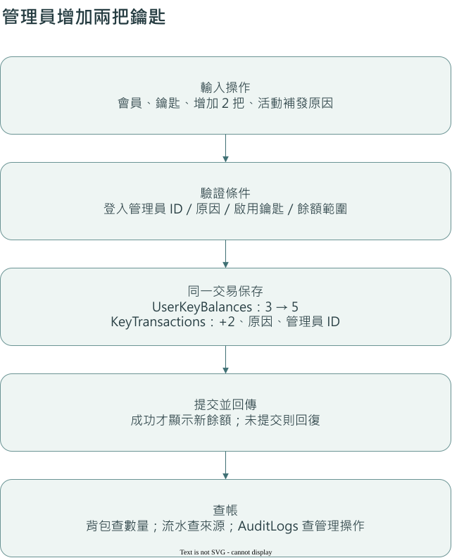
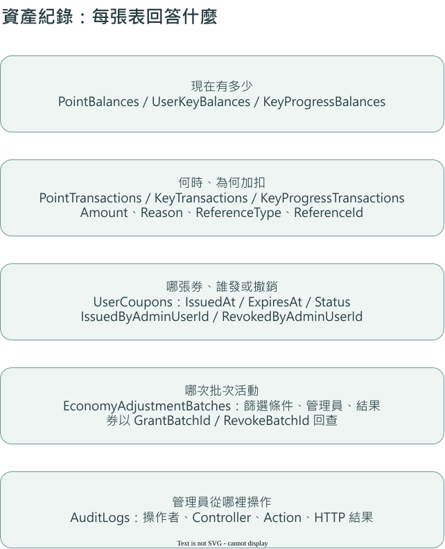

# 5＋1 系統：快速查閱與操作流程

QMAH 的 5＋1 是五個功能系統（圖鑑、遊戲、社群、商城、會員）與一個跨系統營運入口。Shared 是共用文件入口，`QMAH.Infrastructure` 是共用程式庫，兩者都不是業務系統。

各系統可同時開發，以下步驟用來解釋一次操作如何執行，不是各系統的開發排程。分工與跨系統確認項目見[前台功能接手指南](../frontend/feature-development-guide.md#平行開發對照)；跨文件名詞見[文件閱讀與名詞基準](../reference/terminology.md)。

## 目前專題狀態

本文件同時說明目前已存在的程式與前台接手時會用到的契約。先看下表，可以知道哪些內容已經有實作位置，哪些內容目前仍是接手基線：

| 目前可確認的內容 | 實作位置／目前狀態 |
| --- | --- |
| API 與對外資料契約 | `QMAH.Api` 的 V1 Controller、DTO、OpenAPI 與 Scalar 測試入口 |
| 管理後台與營運中心 | `QMAH.Web` 的 Razor 管理頁面；營運統計與批次資產入口為 `Controllers/OperationsController.cs` |
| 共用資料與規則 | `QMAH.Infrastructure` 的 `QmahDbContext`、Identity 與共用 Service |
| 本機資料基線 | `QMAH-Database` 的 `db-v0.8.0` Snapshot；主 Repository 的 `database/Schema.sql` 是結構契約 |
| 使用者前台 | `QMAH.Client` 已建立 Angular 啟動、HttpClient、Cookie、XSRF 與代理設定；`src/app/app.routes.ts` 目前仍是空路由，正式功能畫面由前台開發逐項接手 |
| Mini Game | 模式、Attempt、開始／完成契約與獎勵欄位已預留；各玩法的拼圖、翻牌等原始結果驗證仍需由後續功能實作 |

這個狀態表是閱讀定位，不是功能承諾或開發先後。詳細欄位、權限與限制仍以程式、資料庫契約及[REST API 契約](../reference/rest-api.md)為準。

## 一分鐘快速查閱

| 想做什麼 | 程式入口 | 最先確認的事 |
| --- | --- | --- |
| 啟動管理後台 | `QMAH.Web/Program.cs` | Web 執行 Razor 管理後台 |
| 串接使用者前台 | `QMAH.Api/Controllers/V1` | Angular 呼叫 API，再由 API 查資料庫 |
| 增減會員點數或鑰匙 | `EconomyService.AdjustPointsAsync`／`AdjustKeysAsync` | 傳增減量、原因、會員 ID 與管理員 ID |
| 批次增加或扣除資產 | `OperationsController`、`BulkEconomyService` | 目前批次處理點數及券；先預覽再執行 |
| 顯示圖片 | `QmahMediaUrlResolver` | 使用 API 回傳的網址，搬 CDN 還需搬檔案及設定來源 |
| 記錄前台登入日數 | `DailyActivityService` | 前台明確呼叫登入活動 API，後台登入不計入 |
| 查現在有多少 | Balance 表 | 保存現在餘額 |
| 查何時、為何、由誰異動 | Transaction 表及券的生命週期欄位 | 保存來源；人工調整另記管理員 |

第一次接手可從下一節讀到自己負責的系統；只查問題時，使用上表與頁內目錄即可。

## 第一步：分清四個名詞

前端是在瀏覽器執行的介面程式，後端是在伺服器驗證身分、處理規則及讀寫資料的程式。前台是一般會員使用的功能，後台是管理員使用的功能。

Angular 是使用者前台的前端，`QMAH.Api` 是它呼叫的後端。`QMAH.Web` 包含管理後台的 Controller 與 Razor 介面。`QMAH.Infrastructure` 提供共用服務與資料模型，本身不需要設為啟動專案。

## 第二步：跟著一次請求走

以查看鑰匙背包為例：

1. 瀏覽器送出請求。前台進 API，管理後台進 Web。
2. 登入驗證從 Cookie 確認身分，再檢查此人有沒有權限讀取目標會員。已登入不等於能看所有會員。
3. Controller 接收參數並呼叫 Service。Controller 是 HTTP 入口，Service 是處理規則的方法集合。
4. Service 透過 `QmahDbContext` 查 SQL Server。DbContext 把 C# 查詢與異動交給資料庫。
5. API 回傳 DTO，也就是給畫面使用的一組欄位；管理後台則把 ViewModel 交給 Razor View 顯示。

修改資料時，第四步還需要驗證條件及保存變更。如果餘額與流水必須一起成立，就用資料庫交易包住兩者。

## 第三步：看一次加鑰匙的完整例子

以下假設會員原有 3 把一般鑰匙，活動補發 2 把。數字只用來說明流程。

1. 管理員在背包選會員及鑰匙，輸入 `+2` 與「活動補發」。送出的是增加量，不是指定餘額為 5。
2. `KeyBackpackController` 從登入身分取得管理員 ID，傳給 `AdjustKeysAsync`。會員 ID 是收受者，管理員 ID 是操作人。
3. Service 檢查原因、非零增減量、管理員 ID 及鑰匙是否啟用，再讀目前餘額。扣除後會小於 0 就回傳衝突，不寫負數。
4. 同一交易把 `UserKeyBalances.Balance` 改成 5，並新增 `KeyTransactions`：`Amount = 2`、會員、鑰匙、原因、時間與 `CreatedByAdminUserId`。
5. 提交成功後，餘額與流水一起成立。未提交的交易失敗時會回復，不留下只有扣款卻沒有紀錄的半套變更。
6. 背包顯示 5 把，流水說明其中 2 把來自活動補發。符合稽核條件的管理請求另由 `AdminAuditLogFilter` 記錄操作結果。

點數走同樣概念，改用 `AdjustPointsAsync`、`PointBalances` 與 `PointTransactions`。

這兩個人工調整方法會用 EF execution strategy（資料庫重試策略）包住交易，並沿用同一流水 ID 判斷先前重試是否已成功。但瀏覽器重新送出另一個請求會產生新 ID，不能把它理解為所有重複點擊都會自動去重。

## 圖鑑：文物如何變成會員的解鎖收藏

1. 管理後台建立或匯入文物，保存分類、年代、來源、授權與圖片路徑。
2. 題庫、商品及貼文以 `ArtifactId` 引用文物，自己的題目、價格及貼文內容仍分開保存。
3. 使用鑰匙時，`EconomyController` 呼叫 `UnlockArtifactAsync`。NORMAL 查所有合格文物、CATEGORY 依分類、ERA 依年代；共同條件是啟用且會員尚未解鎖。
4. 前三種由伺服器抽選，UNIVERSAL 才接受指定文物。沒有候選就不扣鑰匙。
5. 成功時保存餘額、扣除流水與 `ArtifactUnlocks`；解鎖列的 `KeyTransactionId` 可回查這次消耗。

前台成功後更新背包及收藏結果，失敗則顯示 API 原因。文物總數讀即時資料，不能寫死展示件數。詳細入口見[圖鑑](../quick-reference/catalog.md)。

## 遊戲：作答、投票、領獎分開處理

1. `GameRooms` 保存房間，`GamePlayers` 保存參加者，`GameRounds` 保存回合。
2. 作答進 `RoundAnswers`，投票進 `Votes`。提交一票不等於立即發點數。
3. 主遊戲獎勵由 `MiniGameController.RewardMainGame` 呼叫 `RewardMainGameAsync`；前台要串接結算入口。
4. Mini Game start 建立 Attempt（一次遊玩紀錄），保存素材池、設定及 Seed（種子）。complete 才處理分數與獎勵。
5. 點數直接入帳，鑰匙進度先累積。假設門檻 100、原有 96、這次加 10，就轉 1 把一般鑰匙並留下 6 進度。實際數字讀後台設定。

目前 complete 檢查 `rawScore` 範圍及 `rawResultJson` 格式，直接把 `rawScore` 當成 `NormalizedScore`；逐玩法驗證拼圖、翻牌或操作結果尚未完成。新增玩法還需要實作這部分，不能只加模式資料就當成可正式遊玩。每日獎勵限制目前使用 UTC 日期。

多個結算方法仍直接開 transaction，串接前需驗證與 Program 的 SQL 重試設定是否相容。本文件描述目前程式流程，不代表這些路徑已完成整合測試。詳細入口見[遊戲](../quick-reference/game.md)。

## 社群：內容、活動與加碼分開查

1. 貼文保存作者及發布狀態，留言保存所屬貼文，回覆另帶父留言 ID。
2. 活動保存主辦者、時間與位置，報名保存活動與會員的參與關係。地圖負責選址與顯示。
3. 檢舉依目標類型及 ID 查找內容；不能把目標 ID 當成對所有內容表都有外鍵。
4. `CommunityRewardService` 處理加碼來源與發放；私人額度和官方活動依規則分開處理，邀請由 `GameRoomInvitationService` 串接。
5. 查是否報名看報名資料，查是否領獎看資產流水。活動存在不代表獎勵已發給全部參加者。

前台分別顯示報名、邀請及領取結果，見[社群](../quick-reference/social.md)。

## 商城：券的規格與手上的一張券

1. `CouponDefinitions` 是券的規格，包含折抵方式、門檻及期限。`UserCoupons` 是發給會員的一張實際券，同種券領兩次有兩個 ID。
2. `RedeemPointCouponAsync` 讀取成本、扣點、寫點數流水及建立券；期限從本次 `IssuedAt` 計算。
3. 管理員發券保存 `IssuedByAdminUserId`、`IssueReason`；撤銷保存 `RevokedByAdminUserId`、`RevokedAt`、`RevokeReason`。
4. 查詢時同步過期狀態：符合條件的可用券變成 `EXPIRED`。`USED` 是已用，`REVOKED` 是已撤銷，資料仍保留。
5. 購物車是購買意向，訂單明細保存成交快照，付款另有結果。購物車金額不是營收。

目前沒有獨立的 CouponTransactions 表，券歷史由持券列上的生命週期欄位保存。前台要區分「券的種類」與「要使用的那張券」，見[商城](../quick-reference/store.md)。

## 會員：何時算登入一天

1. Identity 處理帳密及鎖定，API 與 Web 各有登入 Cookie。
2. 前台明確呼叫 `POST /api/v1/me/daily-activity/login` 才記錄登入活動；一般會員查詢不會自動加天數。
3. 同會員、同 UTC 日期、同 LOGIN 類型只保留一列。再呼叫只更新次數及最後時間，不多算一天。
4. 查詢時從日期算累積與連續天數，不另存每月統計快照。個人登入率是累積登入日數除以建立帳號至今的日數。
5. 此流程會檢查登入次數／連續登入成就，取得後寫 `UserAchievements`。配戴稱號時再檢查是否持有。

管理後台登入不觸發此流程。其他成就不能僅因已有定義就推論已接好自動判定，見[會員](../quick-reference/user.md)。

## 營運中心：看整體與發起批次資產活動

營運中心是 5＋1 中的跨系統入口，入口為 `OperationsController`，使用各系統的既有資料查詢與統計。

1. 選日期範圍，再看會員、付款、遊戲與活動指標。各指標使用的日期欄位不同，須連同定義閱讀。
2. 期間登入率計算登入過的不重複會員占會員母體的比例。同一人登入十次仍是一人，與會員頁的個人登入日數比例不同。
3. `BulkEconomyService.PreviewAsync` 顯示篩選人數，此時尚未異動資產。
4. 正式執行重新查詢會員，所以預覽後資料有變動時，人數可能不同。
5. `EconomyAdjustmentBatches` 保存條件、原因、管理員、目標及結果數量。目前批次支援點數與券，正式執行採全有或全無。
6. 活動整體看批次，某會員實際變更看流水或持券；`AuditLogs` 保存管理操作入口與結果，不記每個 API 的完整內容。

## 查帳快速對照

| 問題 | 先查 | 接著核對 |
| --- | --- | --- |
| 目前多少點 | `PointBalances` | 會員 ID 與 Balance |
| 為何多兩把鑰匙 | `KeyTransactions` | Amount、Reason、時間、鑰匙及來源 |
| 誰人工調整 | `CreatedByAdminUserId` | 與收受者 UserId 分開辨識 |
| 進度為何減少 | `KeyProgressTransactions` | 同來源的進度轉換與一般鑰匙增加 |
| 哪批發的券 | `UserCoupons.GrantBatchId` | 批次主檔的條件、原因與管理員 |
| 誰撤銷券 | `RevokedByAdminUserId` | 原因、時間及 RevokeBatchId |
| 管理員執行什麼操作 | `AuditLogs` | 操作者、日期、Controller、Action、HTTP 結果 |

`ReferenceType`／`ReferenceId` 用來追溯不同來源，不代表每個來源都有 SQL 外鍵。精確欄位及外鍵見[資料表參考](../architecture/database-reference.md)。程式註冊與共用元件見[啟動與共用服務](../architecture/runtime-and-shared-services.md)。
