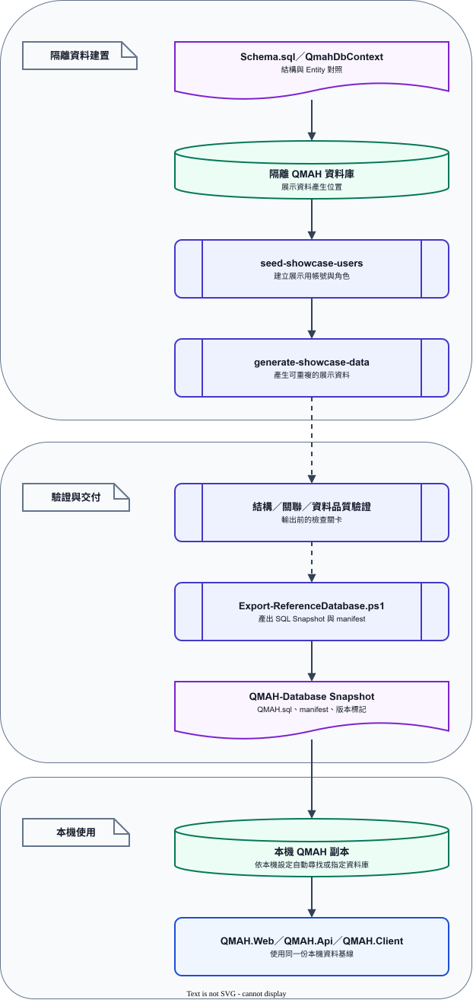

# QMAH 資料工具參考

資料工具處理資料匯入、隔離展示資料與完整 Snapshot 交付。一般啟動只需從 [QMAH-Database db-v0.7.0 Release](https://github.com/MSIT173-03/QMAH-Database/releases/tag/db-v0.7.0) 取得相容的 `QMAH.sql` 或 `.bak`；不需開啟本目錄的工具，也不需手動執行增量 SQL。`.bak` 僅在 GitHub Release 提供，不提交到 Repository。

## 工具分工

| 工具 | 用途 |
| --- | --- |
| `NpmDataWorkbench` | 下載、整理與檢查 NPM Open Data 文物資料 |
| `QmahCatalogImport` | 將符合格式的 JSON 匯入 QMAH Catalog，支援預覽與套用 |
| `QmahDatabaseRelease` | 產生展示資料、匯出 Snapshot、還原備份與執行 Schema／資料驗證 |
| `Export-ReferenceDatabase.ps1` | 單一 Snapshot Release pipeline |

共用工具原始碼位於 [QMAH/tools/QmahDataTools](https://github.com/MSIT173-03/QMAH/tree/main/tools/QmahDataTools)；資料庫測試資料、展示流水、商品產生器與 Snapshot 工具位於 [QMAH-Database/tools/QmahDataTools](https://github.com/MSIT173-03/QMAH-Database/tree/main/tools/QmahDataTools)。工具輸出放在各自工作區的 `_工具輸出`，不提交到 Git。

## Snapshot 產出流程

1. 在隔離的 `QMAH` 資料庫完成需要交付的 Schema 與共同資料驗證。
2. 在 QMAH-Database Repository 根目錄執行：

   ```powershell
   .\tools\QmahDataTools\Export-ReferenceDatabase.ps1 -Version 0.7.0
   ```

3. Pipeline 會建立暫時 LocalDB、還原並驗證資料、檢查 Web 啟動與資料 parity，再輸出交付用 `.bak`、`.sql`、checksum 與報告。
4. 驗證成功後，將完整 SQL Snapshot 更新到與 QMAH 並列的 `QMAH-Database/QMAH.sql`，同步更新 QMAH 的 `database/VERSION`、Database Repository 的 `manifest.json` 與 Git tag。

exporter 預設寫入 sibling Repository 的 `QMAH-Database/QMAH.sql`。目標 Repository 或指定資料夾不存在時，腳本會在開始時停止，避免把大型 Snapshot 寫回產品程式 Repository。



*圖 5：隔離資料庫經過 Schema／資料驗證後，產出同源的 SQL、BAK、checksum 與報告，再交付至 QMAH-Database。*

[圖表 IR 原始檔](../diagrams/snapshot-pipeline.json) · [draw.io 編輯檔（QMAH-Docs 專案）](https://github.com/MSIT173-03/QMAH-Docs/blob/main/diagrams/snapshot-pipeline.drawio)

若執行環境不是固定的 sibling 結構，可以明確指定 Snapshot 輸出位置；`-RepositorySqlPath` 是完整檔案路徑，或以 `-DatabaseRepositoryPath` 搭配 `-RepositorySqlFileName` 指定資料夾與檔名：

```powershell
.\tools\QmahDataTools\Export-ReferenceDatabase.ps1 `
  -Version 0.7.0 `
  -RepositorySqlPath 'D:\qmah-snapshots\QMAH.sql'
```

自訂路徑適合隔離環境或 CI 暫存輸出；正式交付仍應把驗證後的檔案命名為 `QMAH.sql`，放入 QMAH-Database 並建立對應 Git tag。只需要讀取 Snapshot 時，可直接從 QMAH-Database 的 GitHub 檔案頁或 Raw URL 取得，不必在產品 Repository 保留副本。

## 展示資料命令

`QmahDatabaseRelease` 提供下列命令：

```text
reset-password --connection <connection> --email <email> [--password <password>] [--credentials <path>] [--backup <path>]
seed-showcase-users --connection <connection> [--credentials <path>] [--backup <path>]
generate-showcase-data --connection <connection> [--post-count <1-512>] [--order-count <1-512>] [--activity-days <0-3650>] [--point-transaction-count <0-10000>] [--key-transaction-count <0-10000>] [--key-progress-transaction-count <0-10000>] [--seed <number>]
generate-showcase-ledger --connection <connection> [--activity-days <0-3650>] [--point-transaction-count <0-10000>] [--key-transaction-count <0-10000>] [--key-progress-transaction-count <0-10000>] [--seed <number>]
```

`seed-showcase-users` 會建立隔離展示用會員；`generate-showcase-data` 會以穩定識別碼產生彼此有關聯的貼文、留言、訂單、付款紀錄、商品評價、每日登入／簽到、點數流水、鑰匙流水、鑰匙進度流水與符合登入條件的成就。`generate-showcase-ledger` 只產生後四類活動／資產資料，不建立社群與商城資料。命令只更新工具管理的資料，不刪除其他資料。完成後仍要透過 Snapshot pipeline 輸出可直接還原的完整 SQL，啟動環境不需額外執行工具。

## 文物來源數量與取樣

NPM Open Data 的 8 個正式分類各自有獨立 API 陣列。`NpmArtifactPipeline --estimate-only` 會逐類輸出：

| 輸出欄位 | 意義 |
| --- | --- |
| `available` | API 回應中的原始筆數，是本次來源可見量的上限候選 |
| `question-ready` | 已先通過識別碼、名稱、來源網址、主圖、說明、年代與年代規則的候選筆數 |

GUI 的「套用來源可用上限」使用最近一次估算的 `available` 填入八類目標；這不等於最後會寫入的筆數。圖片下載失敗、授權／欄位檢查或完整匯入預檢仍可能使輸出變少。數量欄位接受非負 Int32，`0` 表示略過該類，沒有額外的固定件數上限。

### 有效上限

| 項目 | 輸入或觀測範圍 | 實際判定 |
| --- | ---: | --- |
| 每類線上收集目標 | `0`～`2,147,483,647` | `available`、`question-ready`、圖片、年代與品質規則 |
| `available` | 每次 API 估算得到的原始筆數 | 只代表該次來源可見量，會隨 API 資料更新 |
| `question-ready` | 估算後通過初步規則的候選筆數 | 不大於 `available`，仍須通過完整輸入預檢 |
| 匯入器每類文物／商品上限 | 各 `1`～`2,147,483,647` | 輸入 JSON 實際筆數、Schema、唯一鍵與關聯資料 |
| `ArtifactProductGenerator` | 正整數或 `--count all` | 輸入資料包中符合條件且可安全建立商品的文物 |
| 展示流水 | 活動天數 `0`～`3,650`；三種資產流水各 `0`～`10,000` | 只管理 `SHOWCASE_GENERATED` 批次，保留其他來源歷史 |

2026-09-03 最後一次來源估算的觀測值如下：

| 分類 | `available` | `question-ready` |
| --- | ---: | ---: |
| BRONZE | 6,238 | 1,355 |
| CERAMIC | 25,631 | 9,563 |
| JADE | 13,501 | 1,153 |
| ENAMEL | 2,523 | 1,120 |
| LACQUER | 764 | 157 |
| COIN | 6,953 | 5,081 |
| CARVING | 670 | 159 |
| PAINTING | 18,142 | 419 |
| 合計 | 74,422 | 19,007 |

上表只保存本次 API 回應的觀測值，不是永久資料上限；來源更新後應重新執行 `--estimate-only`。

256 件（八類各 32 件）是預設 1 與目前 Snapshot 的參考設定，不是來源或工具的固定封頂。估算結果應在實際執行前重新取得，不能把一次輸出的筆數寫成永久上限。

### 預設 1

兩個共用工作台都保存 `tools/QmahDataTools/NpmDataWorkbench/presets/default-1-256.json`。啟動時自動載入，也可按「載入預設 1」恢復。預設包含八類各 32 件、`diverse`、seed `173`、不產生預覽、下載圖片、每類文物匯入上限 32 與商品上限 256；不含路徑、連線字串、帳密或 Token。欄位與同步方式見 [預設檔說明（QMAH）](https://github.com/MSIT173-03/QMAH/blob/main/tools/QmahDataTools/NpmDataWorkbench/presets/README.md) 與 [預設檔說明（QMAH-Database）](https://github.com/MSIT173-03/QMAH-Database/blob/main/tools/QmahDataTools/NpmDataWorkbench/presets/README.md)。

文物收集的 `--selection-mode` 有三種：

| 模式 | 規則 | 適用情境 |
| --- | --- | --- |
| `diverse`（預設） | 依欄位完整度排序，再在年代桶之間輪流取樣 | 建立穩定且年代分布較分散的參考資料 |
| `random` | 以 `seed + 分類代碼 + 來源編號` 產生穩定順序，再在年代桶之間輪流取樣 | 更換 seed 取得不同樣本；相同 seed 可重現 |
| `sequential` | 依來源編號前綴與尾端數字排序 | 檢查來源編號順序與缺號 |

```powershell
dotnet run --project .\tools\QmahDataTools\NpmArtifactPipeline\NpmArtifactPipeline.csproj -- `
  --estimate-only

dotnet run --project .\tools\QmahDataTools\NpmArtifactPipeline\NpmArtifactPipeline.csproj -- `
  --per-dataset 64 `
  --selection-mode random `
  --seed 173 `
  --output D:\qmah-data\output\random `
  --media-root D:\qmah-data\output\media

dotnet run --project .\tools\QmahDataTools\NpmArtifactPipeline\NpmArtifactPipeline.csproj -- `
  --per-dataset 64 `
  --selection-mode sequential `
  --output D:\qmah-data\output\sequential `
  --media-root D:\qmah-data\output\media
```

`random` 是可追查的固定 seed 隨機排序，不是每次執行都不可重現的亂數。`sequential` 只排序候選資料；缺欄位、年代需人工確認或圖片下載失敗的資料仍會造成缺號。模式與 seed 會寫入 `manifest.json`。

## 展示流水與條件式成就

展示流水不是固定 SQL，也不是把所有鑰匙與成就編號複製成程式內清單：

| 資料 | 產生規則 |
| --- | --- |
| 每日活動 | 依啟用展示會員與活動天數產生 `LOGIN`，部分日期產生 `CHECK_IN`；日期不超過執行日前一天 |
| 點數流水 | 以 seed 產生取得／使用交易，標記 `SHOWCASE_GENERATED`，重跑時保留非工具資料 |
| 鑰匙流水 | 讀取啟用中的 `catalog.KeyDefinitions` 後分配；沒有啟用定義時輸出警告並略過 |
| 鑰匙進度流水 | 依展示會員產生獨立的進度取得／使用交易與餘額 |
| 登入成就 | 讀取啟用中的 `DAILY_LOGIN_COUNT`／`DAILY_LOGIN_STREAK` 及 `ThresholdValue`，登入歷史達標後才建立 `UserAchievements` |

`seed-showcase-users` 的固定成就列只作為展示帳號初始 fixture；產品實際登入判定仍由 `DailyActivityService` 依資料庫成就定義執行。產生器使用穩定識別碼，重跑相同參數時更新同一批工具資料；活動天數縮短不會刪除既有活動歷史。

本機展示帳號與密碼只存在於未提交的 credentials 檔案或密碼管理工具。密碼不貼入文件、Issue、Commit 或 Pull Request；登入問題使用 `reset-password` 更新指定的隔離資料庫。

## 文物匯入與圖片

文物匯入的欄位、預覽 token、錯誤處理與重試規則詳見 [文物資料匯入](../features/catalog-import.md)。NPM 資料來源、授權、圖片路徑與商品產生規則詳見 [資料與圖片使用](../features/data-and-media.md)。匯入工具不負責把遠端圖片永久下載到產品 Repository，也不取代媒體交付設定。

## 交付邊界

- `QMAH/database/Schema.sql` 是可閱讀的結構契約。
- `QMAH/database/VERSION` 只標記主 Repository 目前相容的 Database tag。
- `QMAH-Database/QMAH.sql` 是完整 SQL Server Snapshot，包含結構、共同資料、Identity 與已驗證的展示情境。
- Snapshot 產出後，若同時交付 `.sql` 與 `.bak`，兩者必須來自同一次匯出；不可分別手動維護。QMAH 主 Repository 的 Release 只作版本導覽，完整 SQL 來源是 QMAH-Database。
- Patch、固定 Seed 與大型 SQL 不放回 QMAH 的產品程式路徑；需要重建資料時使用工具與完整 Snapshot 流程。
