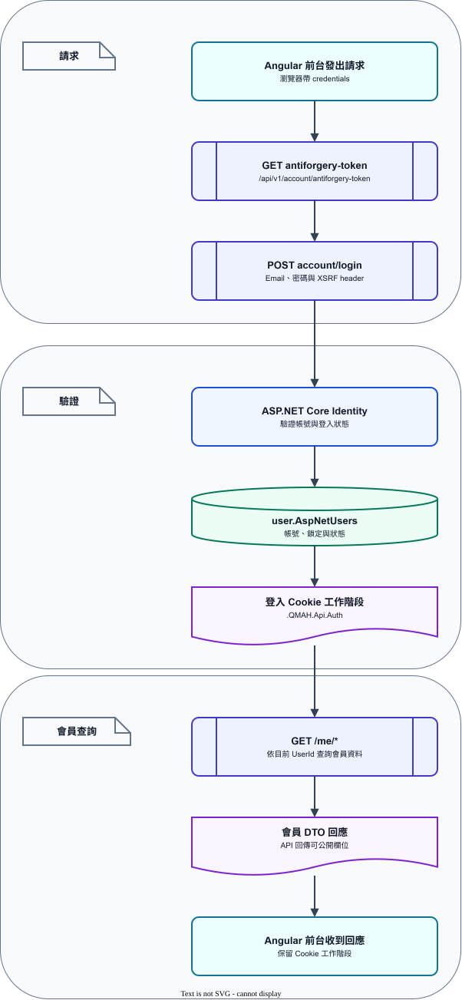

# REST API 契約

QMAH API 位於獨立的 `QMAH.Api` 專案，所有版本化 Endpoint（API 可呼叫的路徑）以 `/api/v1` 開頭。

API 與 Razor（ASP.NET Core 的伺服器端頁面技術）後台共用 `QMAH.Infrastructure`、Identity（登入與會員驗證元件）與 SQL Server（資料庫服務）。API 不複製 Entity（資料庫對應模型），也不建立第二個資料庫。

開發環境 API 位於 `https://localhost:7249`。Development（開發環境）預設提供 `/openapi/v1.json` 與 `/scalar/v1`。

非 Development 環境只有在 `OpenApi:Enabled=true` 時提供 OpenAPI。若也要提供 Scalar（互動式 API 文件頁面），另外啟用 `OpenApi:ScalarEnabled=true`。

Angular 前端使用者前台平常透過 proxy（前端開發伺服器的轉送設定）使用相對路徑 `/api/v1`。

## API 文件與測試頁面

互動式 API 文件頁面使用 Scalar。Scalar 讀取 OpenAPI（API 的標準契約格式）契約，列出每個 Endpoint（API 可呼叫的路徑）的 request／response Schema（送入／回傳資料的欄位格式）。頁面也提供參數填寫與測試 request（測試請求）功能。

`OpenAPI`（API 的標準契約格式）是描述 API 路徑、參數、請求、回應與驗證方式的機器可讀文件。

QMAH 由 ASP.NET Core 依 Controller（處理 API 請求的程式類別）、DTO（API 對外傳輸的資料格式）、參數與 attributes（程式上的設定標記）產生 `/openapi/v1.json`。前端、測試工具與程式碼產生器都以這份 JSON（結構化資料格式）作為 API 定義。

API 啟動後可使用下列網址：

| 用途 | 網址 |
| --- | --- |
| 原始 OpenAPI 契約 | `https://localhost:7249/openapi/v1.json` |
| Scalar 互動式文件 | `https://localhost:7249/scalar/v1` |

API 開發與測試流程如下：

1. 在專案根目錄執行 `dotnet run --project QMAH.Api`。
2. 開啟 `https://localhost:7249/scalar/v1`，查看 Endpoint（API 可呼叫的路徑）、參數、Schema（資料欄位格式）與回應狀態。
3. 測試登入或其他寫入 API 前，先呼叫 `GET /api/v1/account/antiforgery-token`。
4. 使用同一個 browser session（瀏覽器工作階段）呼叫登入，讓 Identity Cookie（登入狀態 Cookie）留在該 session。
5. POST、PUT、DELETE request（HTTP 請求）帶上 `X-XSRF-TOKEN` Header（HTTP 標頭），並沿用 Cookie（瀏覽器保存的小型資料）。
6. 每次呼叫依「共通回應」中的 status code（HTTP 狀態碼）實際意義處理結果，不以單一 `200` 判斷所有成功情況。

GUI 啟動方式如下：

- Visual Studio 開啟 `QMAH.sln` 後，使用啟動設定選擇 `QMAH API`，即可單獨啟動 API。
- Visual Studio 選擇 `QMAH 後端主機與管理後台（API＋Razor）`，即可同時啟動 `QMAH.Api` 與 `QMAH.Web`。
- Visual Studio 的 API 啟動設定使用 `https` profile（啟動設定檔），網址為 `https://localhost:7249`；HTTP profile（啟動設定檔）的網址為 `http://localhost:5147`。
- VS Code 開啟 Run and Debug（執行與除錯介面）面板後，可選擇 `QMAH API（https）` 單獨啟動後端 API、選擇 `QMAH Angular 前端使用者前台` 單獨啟動 Angular 前端，或選擇 `QMAH 使用者前台開發（API 後端＋Angular 前端）` 同時啟動兩者。

上述 GUI（圖形化介面）設定由 `QMAH.slnLaunch`、`QMAH.Api/Properties/launchSettings.json` 與 `.vscode/launch.json` 管理，不需要另外建立啟動設定。

Scalar 的 `Test Request` 會使用目前頁面的 session（瀏覽器工作階段）。

Postman、Insomnia 或前端測試程式必須保留 cookies（瀏覽器保存的登入資料），並設定 `credentials`（是否攜帶 Cookie 的請求設定）。request body（請求本文，送出的 JSON 內容）則依 OpenAPI 契約傳送。

`/openapi/v1.json` 可交給前端產生 client（呼叫 API 的程式碼）、執行 contract test（契約測試）或檢查 breaking change（會讓既有呼叫失效的變更）。

正式環境（正式使用的部署環境）預設不公開文件。部署時若需要公開 OpenAPI，須以設定檔明確啟用 `OpenApi:Enabled`；若也需要公開 Scalar，另須啟用 `OpenApi:ScalarEnabled`。

測試用帳號與密碼不得寫入文件。

契約驗證腳本需在 API 已啟動時執行：

```powershell
pwsh -File .\tools\Validate-OpenApi.ps1 -OpenApiUrl http://localhost:5147/openapi/v1.json
```

腳本會比對 Controller action 與 operation catalog（API 行為說明清單）。

它會檢查 operation（一次 API 呼叫）數量、唯一 `operationId`（穩定且唯一的 API 識別名稱）、`summary`（清單中的短摘要）、`description`（完整行為說明）、Cookie security metadata（登入驗證的文件資訊）與成功回應。

腳本也會檢查 ProblemDetails（標準錯誤回應格式）、路徑／查詢參數、request body（請求本文，送出的 JSON 內容）欄位，以及圖片上傳的 `multipart/form-data`（表單檔案上傳格式）、`file` binary（原始檔案內容）、`altText`（圖片替代文字）與 `413` 定義。

## API 文件的維護方式

Controller 負責 HTTP 行為與授權。DTO（API 對外傳輸的資料格式）負責回應資料形狀；OpenAPI transformer（自動補充 API 文件的元件）負責補齊摘要、描述、成功狀態與錯誤狀態。

新增或修改 Endpoint（API 可呼叫的路徑）時，先由 ASP.NET Core 產生參數與資料格式。

再於 `QMAH.Api/Infrastructure/OpenApi/QmahOpenApiOperationCatalog.cs` 補上台灣繁中摘要與目前行為說明。

需要登入的 Endpoint 由 `[Authorize]` 產生 Cookie 登入資訊。

程式行為改變時，同步檢查 Controller 的回應狀態、OpenAPI transformer 的狀態碼與本文件的 Endpoint 說明。

`summary` 用一句話說明用途；`description` 說明登入條件、送出欄位、成功結果與可能的流程錯誤。各 operation 的專業用語依 [API 名詞表](./api-glossary.md) 在條目內直接附括號，不依賴其他段落先行定義。

## OpenAPI 文字規範

欄位分工遵循 OpenAPI 的定義。`summary`（清單中的短摘要）用來快速辨識用途；`description`（完整行為說明）用來說明端點行為，必要時可使用 CommonMark（OpenAPI 文件通用的 Markdown 格式）。

每個 operation（一次 API 呼叫）都有對應的 catalog（API 行為說明清單）項目。說明必須直接對應實際要呼叫的欄位與結果，不使用未替換的範例文字。

| 欄位 | 文件標準 | QMAH 實作方式 |
| --- | --- | --- |
| `summary`（清單中的短摘要） | 一行短句，讓清單能直接看出用途；使用動詞＋資源或目的，不放狀態碼或段落 | 例如 `查詢文物清單`、`建立商城訂單`、`取得遊戲回合詳情` |
| `description`（完整行為說明） | 說明登入條件、路徑／查詢／JSON 欄位、資料範圍、成功結果與流程錯誤；欄位名稱使用反引號 | 由 `QmahOpenApiOperationCatalog` 逐一維護，直接寫出實際欄位與允許值 |
| `operationId`（穩定且唯一的 API 識別名稱） | 在整份文件中唯一且穩定，供 client generator（前端程式產生工具）與 contract test（契約測試）辨識 | 使用 `{Controller}_{Action}`，例如 `Catalog_GetArtifact` |
| `tags`（功能分組標籤） | 依功能群組整理，讓 Scalar（互動式 API 文件頁面）清單容易瀏覽 | 沿用 ASP.NET Core Controller 的分組名稱 |
| `responses`（回應定義） | 將成功、欄位錯誤、登入、權限、找不到資料、流程衝突與服務失敗分開列出 | transformer（自動補充 API 文件的元件）統一補入 `400`、`500`、登入端點的 `401`／`403`，並依實際 action 補入 `201`、`202`、`204`、`404`、`409`、`413` 或 `503` |

摘要和描述的文字規範以 [OpenAPI 3.1 Operation Object](https://spec.openapis.org/oas/v3.1.0#operation-object) 為基準。

HTTP 狀態碼的語意依 [RFC 9110 HTTP Semantics](https://www.rfc-editor.org/rfc/rfc9110) 解讀。

## 共通回應

分頁 Endpoint（API 可呼叫的路徑）回傳：

```json
{
  "items": [],
  "page": 1,
  "pageSize": 20,
  "totalCount": 0,
  "totalPages": 0
}
```

`page` 從 1 開始，`pageSize` 會限制在 1 至 100；沒有資料時 `totalPages` 為 0、`page` 為 1。前台依回應的 `totalPages` 呈現分頁，空集合表示查詢結果為空，不視為錯誤。

錯誤使用 RFC 9457（錯誤回應格式的標準規格）`ProblemDetails`（標準錯誤回應格式）／`ValidationProblemDetails`（欄位驗證錯誤格式），常見狀態如下：

| 狀態 | 意義 |
| ---: | --- |
| 201 | 已建立新資源，回應包含建立結果 |
| 202 | 已接受要求並進入後續處理，不代表處理已完成 |
| 204 | 操作成功且沒有回應內容 |
| 400 | 輸入格式、欄位或流程條件不符合 |
| 401 | 尚未登入或登入狀態失效 |
| 403 | 已登入但沒有該操作權限 |
| 404 | 找不到資源或資源目前不可見 |
| 409 | 與既有資料衝突，例如 Email 已存在 |
| 413 | 上傳內容超過端點允許的大小 |
| 429 | 短時間內請求次數過多，稍後再試 |
| 500／503 | 服務或外部資料來源暫時失敗 |

目前的成功回應依 Endpoint（API 可呼叫的路徑）行為固定：

- 建立會員、房間、活動、貼文、留言、圖片、地址或訂單，通常回傳 `201 Created`（已建立資源）。
- 密碼重設申請、遊戲投票與檢舉排入後續處理時，回傳 `202 Accepted`（已接受處理）。
- 登入、登出、防偽權杖、刪除或其他沒有 response body（回應本文）的成功操作，回傳 `204 No Content`（成功且沒有回應本文）。
- 其餘查詢與會回傳 DTO（API 對外傳輸的資料格式）的成功操作，回傳 `200 OK`（成功並回傳資料）。

畫面僅顯示 `title`（錯誤標題）與 `detail`（錯誤詳情）的友善內容。

Controller 名稱、資料表名稱、例外堆疊與內部路徑不直接展示給使用者。

## 存取與驗證

| 類別 | 規則 |
| --- | --- |
| 公開讀取 | 圖鑑、商品、公開貼文、已發布活動、公告貼文、公開遊戲房間與 metadata（供前端使用的選項資料） |
| 登入後讀取 | `/api/v1/me/*`、私人遊戲房間與個人資料 |
| 登入後寫入 | 遊戲建立／加入／作答／投票、建立活動／貼文／留言／檢舉、圖片與訂單 |
| 管理員 | `/api/v1/admin/dashboard` |

登入成功後，後端 API 以 Cookie（瀏覽器保存的小型資料）保存狀態，不回傳自製 JWT（JSON Web Token，另一種登入權杖格式）。

Angular request（前端發出的 HTTP 請求）保留 credentials（是否攜帶 Cookie 的請求設定）。直接跨來源呼叫時，來源列在 API 的 `Cors:AllowedOrigins`；CORS policy（跨來源規則集合）只接受列出的明確來源。

所有 POST、PUT、DELETE 先呼叫 `GET /api/v1/account/antiforgery-token`，再帶 `X-XSRF-TOKEN` Header（HTTP 標頭）。GET 不需要 Anti-forgery（防偽請求驗證）token（驗證用的暫時字串）。



*圖 3：Angular 前台取得防偽 Cookie、建立登入 Cookie，再呼叫需要會員狀態的 API 的順序。*

[圖表 IR 原始檔](../diagrams/api-auth-flow.json) · [draw.io 編輯檔（QMAH-Docs 專案）](https://github.com/MSIT173-03/QMAH-Docs/blob/main/diagrams/api-auth-flow.drawio)

## Endpoint 清單

### 帳號

| Method | Path | 權限 | 用途 |
| --- | --- | --- | --- |
| GET | `/api/v1/account/antiforgery-token` | 公開 | 設定瀏覽器 Anti-forgery Cookie |
| POST | `/api/v1/account/login` | 公開 | Email／密碼登入，成功 204 |
| POST | `/api/v1/account/logout` | 登入後 | 登出並清除登入 Cookie |
| POST | `/api/v1/account/register` | 公開 | 建立會員與 Profile（會員資料） |
| POST | `/api/v1/account/forgot-password` | 公開 | 寄送或模擬寄送密碼重設指示；不透露 Email 是否存在 |
| POST | `/api/v1/account/reset-password` | 公開 | 使用重設 Token（密碼重設驗證字串）更新密碼 |

### metadata、圖鑑與商城

| Method | Path | 參數／用途 |
| --- | --- | --- |
| GET | `/api/v1/metadata` | 取得分類、年代、貼文板塊、貼文／活動／媒體選項與中文 Label（畫面顯示文字） |
| GET | `/api/v1/catalog/artifacts` | `q`、`categoryCode`、`eraCode`、`page`、`pageSize`；只回傳啟用文物 |
| GET | `/api/v1/catalog/artifacts/{id}` | 文物詳情、來源授權、圖片與是否有題庫／商品 |
| GET | `/api/v1/catalog/categories` | 圖鑑分類 |
| GET | `/api/v1/catalog/eras` | 年代篩選 |
| GET | `/api/v1/store/products` | `q`、`categoryCode`、`artifactId`、`page`、`pageSize`；只回傳上架商品 |
| GET | `/api/v1/store/products/{id}` | 商品詳情與對應文物 |
| GET | `/api/v1/store/products/{productId}/reviews` | 公開評價分頁、平均星等與評價總數；只計入已發布內容 |
| GET | `/api/v1/store/products/{productId}/reviews/me` | 登入後取得目前會員對該商品的評價 |
| PUT | `/api/v1/store/products/{productId}/reviews/me` | 登入後新增或修改目前會員的 1 至 5 星評價與短文 |
| DELETE | `/api/v1/store/products/{productId}/reviews/me` | 登入後刪除目前會員所屬的評價；採軟刪除，不影響其他會員的內容 |

Code（系統代碼）是資料契約，不是直接給使用者看的文案；前台應以 metadata（供前端使用的選項資料）的 Label（畫面顯示文字）呈現。文物圖片與商品圖片使用既有 `/media/catalog/` 路徑及其來源授權資料，媒體網址切換規則見[媒體交付設定](../frontend/media-delivery.md)。

### 社群、公告與活動

| Method | Path | 參數／用途 |
| --- | --- | --- |
| GET | `/api/v1/social/posts` | `q`、`boardCode`、`postType`、`artifactId`、`page`、`pageSize`；公開貼文清單 |
| GET | `/api/v1/social/posts/{id}` | 貼文全文、公開留言與可用社群圖片 |
| GET | `/api/v1/social/announcements` | 公告貼文清單；公告是貼文類型，不是另一個編輯資料源 |
| GET | `/api/v1/social/events` | 已核准且已發布活動清單與報名人數 |
| GET | `/api/v1/social/events/{id}` | 活動詳情、座標、名額與目前帳號是否已報名 |
| POST | `/api/v1/social/events` | 登入後建立玩家／官方活動；活動可選模板或自訂活動貼文內容 |
| POST | `/api/v1/social/events/{id}/registration` | 登入後報名活動 |
| DELETE | `/api/v1/social/events/{id}/registration` | 取消目前帳號的活動報名 |
| POST | `/api/v1/social/posts` | 登入後建立一般貼文或公告貼文，可關聯文物、座標與社群圖片 |
| POST | `/api/v1/social/posts/{postId}/comments` | 登入後新增留言或回覆 |
| POST | `/api/v1/social/reports` | 登入後檢舉公開貼文／留言 |

活動是獨立資料，活動通過審核與發布後會有對應的活動貼文；一般公告則是 `SocialPosts` 的公告貼文類型。地址／地點可只填文字，也可同時提供成對的 `latitude` 與 `longitude`；地圖不是前台的必要元件。

### 社群媒體

| Method | Path | 權限／用途 |
| --- | --- | --- |
| POST | `/api/v1/social/media` | 登入後以 `multipart/form-data`（表單檔案上傳格式）上傳；`file` 為必填 binary（原始檔案內容）圖片、`altText`（圖片替代文字）為選填欄位；支援 JPEG／PNG／GIF／WebP，最大 8 MB，超過回傳 413 |
| GET | `/api/v1/social/media/{id}/content` | 公開已發布貼文的可用圖片；擁有者可預覽尚未關聯圖片 |
| DELETE | `/api/v1/social/media/{id}` | 圖片擁有者軟刪除所屬圖片 |

社群圖片使用永久流水號，API 回傳受控 URL（資源網址）；前台不拼接檔名、不讀取實體資料夾，也不把原始檔名當成 HTML 或路徑。官方文物圖鑑圖片不屬於這組社群上傳 Endpoint（API 可呼叫的路徑）。

### 遊戲

| Method | Path | 權限／用途 |
| --- | --- | --- |
| GET | `/api/v1/game/rooms` | 公開房間清單；可用 `status`、`page`、`pageSize` 篩選 |
| GET | `/api/v1/game/rooms/{id}` | 公開／參與中的房間詳情 |
| POST | `/api/v1/game/rooms` | 登入後建立房間 |
| POST | `/api/v1/game/rooms/{id}/join` | 登入後加入房間 |
| POST | `/api/v1/game/rounds/{id}/answers` | 回答中的回合送出答案 |
| POST | `/api/v1/game/rounds/{id}/votes` | 投票中的回合送出投票 |
| GET | `/api/v1/game/rounds/{id}` | 登入後取得回合與答案詳情 |
| GET | `/api/v1/game/rooms/{id}/history` | 房間的回合歷程、每回合答案／票數／勝者與整場排行榜 |

遊戲 API（應用程式介面）不把內部 `PlayerKey` 回傳給前台；前台使用 DTO（API 對外傳輸的資料格式）的玩家 Id（資源識別碼）、顯示名稱與狀態。答案類型與房間狀態使用 metadata（供前端使用的選項資料）／API 文件中的允許值，畫面不另行散落定義字串。

回合詳情與房間歷程會依投票總數、送出時間與答案 Id 產生穩定排名；只有已結算且至少有一票的第一名會標示為勝者。排行榜以各回合收到的票數累計分數，並同時提供作答回合數與獲勝回合數，前台可直接使用這些結果製作單場結算和長期回顧。

### 目前會員與商城操作

| Method | Path | 用途 |
| --- | --- | --- |
| GET | `/api/v1/me` | 取得目前會員資料 |
| PUT | `/api/v1/me/profile` | 更新目前會員 Profile（會員資料） |
| GET | `/api/v1/me/orders` | 查詢目前會員訂單 |
| GET | `/api/v1/me/orders/{id}` | 取得目前會員訂單明細 |
| GET | `/api/v1/me/coupons` | 目前帳號的優惠券 |
| GET | `/api/v1/me/posts` | 目前帳號所屬的貼文 |
| GET | `/api/v1/me/achievements` | 目前帳號的成就 |
| GET | `/api/v1/me/cart` | 取得購物車 |
| POST | `/api/v1/me/cart` | 加入購物車商品 |
| PUT | `/api/v1/me/cart/{productId}` | 更新購物車商品數量 |
| DELETE | `/api/v1/me/cart/{productId}` | 移除購物車商品 |
| GET | `/api/v1/me/addresses` | 查詢地址 |
| POST | `/api/v1/me/addresses` | 建立地址 |
| PUT | `/api/v1/me/addresses/{id}` | 修改地址 |
| DELETE | `/api/v1/me/addresses/{id}` | 刪除地址 |
| POST | `/api/v1/me/addresses/{id}/default` | 設為預設地址 |
| GET | `/api/v1/me/notifications` | 查詢通知 |
| POST | `/api/v1/me/notifications/{id}/read` | 標記通知已讀 |
| POST | `/api/v1/store/orders` | 依目前帳號購物車資料建立訂單 |
| POST | `/api/v1/store/orders/{id}/cancel` | 取消目前帳號仍可取消的訂單 |

「目前會員」由登入 Cookie（瀏覽器保存的登入狀態）決定，request body（請求本文，送出的 JSON 內容）不含切換其他 `UserId`（會員識別碼）的欄位。地址支援手動輸入，座標欄位可完全留白或成對提供。

### 經濟、進程與社群加碼

以下 Endpoint（API 可呼叫的路徑）是 Angular 前端使用者前台接手鑑定點數、鑰匙、優惠券、成就稱號與遊戲獎勵時使用的契約。除公開的活動加碼查詢外，都需要登入；寫入操作均先取得 Anti-forgery（防偽請求驗證）Cookie 與 token（驗證用的暫時字串）。

| Method | Path | 權限 | 用途與主要欄位 |
| --- | --- | --- | --- |
| GET | `/api/v1/me/economy` | 登入後 | 取得鑑定點數、鑰匙進度、各類鑰匙餘額、每把鑰匙的可解鎖文物數量與目前兌換規則 |
| GET | `/api/v1/me/keys/exchange-rules` | 登入後 | 取得目前仍有可解鎖文物的鑰匙兌換規則 |
| POST | `/api/v1/me/keys/{keyCode}/unlock` | 登入後 | 使用一把鑰匙解鎖文物；只有 `UNIVERSAL` 可在 body 傳 `ArtifactId`，其他類型由伺服器抽選 |
| POST | `/api/v1/me/keys/exchange` | 登入後 | 傳送 `RuleId` 與 `Units`，依資料庫規則交換鑰匙 |
| POST | `/api/v1/me/keys/{keyCode}/recycle` | 登入後 | 傳送 `Amount`，只回收已沒有可解鎖文物的鑰匙並取得鑑定點數 |
| GET | `/api/v1/me/coupons/exchange-options` | 登入後 | 取得點數兌換券的成本、折扣、最低消費、有效天數與使用期間 |
| POST | `/api/v1/me/coupons/redeem` | 登入後 | 傳送 `CouponDefinitionId`，扣除鑑定點數並建立一張獨立的會員優惠券 |
| GET | `/api/v1/me/title` | 登入後 | 取得目前配戴的單一成就稱號，未配戴時回傳 `null` |
| PUT | `/api/v1/me/title` | 登入後 | 傳送 `UserAchievementId` 設定稱號；傳送 `null` 清除配戴狀態 |
| GET | `/api/v1/me/daily-activity` | 登入後 | 依每日登入歷史即時計算最後登入日、累積天數、連續天數、最高連續天數與登入率 |
| POST | `/api/v1/me/daily-activity/login` | 登入後 | 由會員前台明確記錄當日登入；同日重複呼叫只增加活動次數，不增加登入天數 |
| GET | `/api/v1/game/modes` | 登入後 | 取得四種 Mini Game（小遊戲）模式、設定與評級門檻 |
| POST | `/api/v1/game/attempts` | 登入後 | 傳送 `ModeCode` 開始一次嘗試；伺服器決定文物池、難度、Seed（結果重現用的隨機種子）與設定，成功回傳 `201` |
| POST | `/api/v1/game/attempts/{id}/complete` | 登入後 | 傳送原始分數與結果資料；伺服器重新計算標準化分數、評級、點數與鑰匙進度 |
| POST | `/api/v1/game/rooms/{id}/reward` | 登入後 | 結算多人主遊戲獎勵；同一會員同一房間不可重複領取 |
| GET | `/api/v1/social/events/{eventId}/reward-policy` | 公開 | 取得活動的每位參與者加碼、有效期間與目前發放狀態；沒有規則時回傳 `null` |
| PUT | `/api/v1/social/events/{eventId}/reward-policy` | 活動發起人／Admin | 設定玩家活動或官方活動的點數、鑰匙加碼與有效期間 |
| GET | `/api/v1/game/invitations` | 登入後 | 取得目前會員收到的私人房間邀請 |
| GET | `/api/v1/game/rooms/{roomId}/invitations` | 房間發起人 | 取得該私人房間送出的邀請與處理結果 |
| POST | `/api/v1/game/rooms/{roomId}/invitations` | 房間發起人 | 傳送 `InviteeUserId` 與選填 `Message` 建立邀請；不預扣資產 |
| POST | `/api/v1/game/invitations/{invitationId}/response` | 被邀請會員 | 傳送 `Decision`（`ACCEPT` 或 `DECLINE`）回應邀請，接受後才嘗試發放加碼 |
| POST | `/api/v1/game/invitations/{invitationId}/cancel` | 邀請發起人 | 取消尚未回應的邀請，歷史資料保留 |
| GET | `/api/v1/game/rooms/{roomId}/reward-policy` | 房間參與者 | 取得私人房間加碼規則與剩餘額度 |
| PUT | `/api/v1/game/rooms/{roomId}/reward-policy` | 房間發起人 | 設定每位參與者的點數／鑰匙加碼與會員總預算；兩種加碼皆為 0 時停用 |

這組資產操作成功通常回傳 `200 OK`（成功並回傳資料）。開始 Mini Game 建立嘗試時回傳 `201 Created`（已建立資源）。

欄位錯誤或業務條件不符回傳 `400`；未登入回傳 `401`；不是資源擁有者或沒有角色權限回傳 `403`；找不到文物、規則、房間或邀請回傳 `404`。

餘額不足、重複領取或目前狀態不允許時回傳 `409`。使用鑰匙時若沒有候選文物，API 仍回傳成功結果，並以回應欄位表示本次沒有解鎖且沒有扣除鑰匙。所有失敗均使用 `ProblemDetails`（標準錯誤回應格式）或 `ValidationProblemDetails`（欄位驗證錯誤格式）。

鑑定點數、鑰匙與優惠券的異動資料是資產歷史的主要來源。`admin.AuditLogs` 不記錄每個 API 讀取或 request body（請求本文）。

目前只有 Web（Razor 管理後台）的具權限非 GET 管理寫入操作會留下必要 metadata（操作時間、操作者、區域、路徑與結果）。點數、鑰匙、優惠券和批次活動則分別以對應流水或批次主檔查帳。

這樣可以查單一會員與活動影響範圍，也不會因前台輪詢而無限制增加稽核資料。

### 管理摘要

| Method | Path | 權限 | 用途 |
| --- | --- | --- | --- |
| GET | `/api/v1/admin/dashboard` | Admin | 目前會員、文物、題庫、社群、活動、訂單、營收與熱門商品摘要 |

逐日／逐月營運檢視由 Razor（ASP.NET Core 的伺服器端頁面技術）後台的「營運中心」提供，統計查詢維持單一資料邊界；其他管理端需求沿用相同的管理摘要資料契約。

## 前端使用者前台呼叫原則

- 先使用 DTO（API 對外傳輸的資料格式）與 metadata（供前端使用的選項資料），不直接依賴 Entity（資料庫對應模型）或資料庫欄位名稱。
- 所有清單保留 loading、空資料、分頁與錯誤狀態。
- 使用者輸入的貼文、留言與商品描述以純文字安全呈現，不使用未清理的 HTML。
- 寫入操作依 `401`、`403`、`409` 與 `ValidationProblemDetails`（欄位驗證錯誤格式）呈現登入、授權、流程衝突與欄位驗證結果。
- 日期使用 API 傳回的 ISO 8601（國際標準日期時間文字格式）值；顯示格式由前台統一處理，不改變原始時間。
